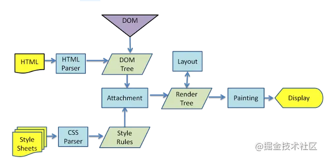

# 盒模型介绍

CSS3中的盒模型有以下两种：
1. 标准盒模型
2. IE（替代）盒模型

两种盒子模型都是由`content + padding + border + margin` 构成，其大小都是由`content + padding + border`决定的，但是盒子的内容宽/高度（即`width/height`）的计算范围根据盒模型的不同会有所不同：

- 标准盒模型：只包含`content`
- IE（替代）盒模型：`content + padding + border`

可以通过`box-sizing`来改变元素的盒模型
- `box-sizing: content-box`：标准盒模型（默认值）
- `box-sizing: border-box`：IE（替代）盒模型

# CSS选择器和优先级

|选择器|示例|
|-|-|
|类型选择器|`h1 {}`|
|通配选择器|`* {}`|
|类选择器|`.box {}`|
|ID选择器|`#unique {}`|
|标签属性选择器|`a[title] {}`|
|伪类选择器|`p:first-child {}`|
|伪元素选择器|`p::first-line {}`|
|后代选择器|`article p`|
|子代选择器|`article > p`|
|相邻兄弟选择器|`h1 + p`|
|通用兄弟选择器|`h1 ~ p`|

通常来说，样式的优先级一般为`!important > style（内联样式 ） > ID选择器 > 类（class）选择器 > 标签选择器`，但是涉及多类选择器作用于一个元素的时候怎么判断优先级呢？在改一些第三方库（比如antd）样式时，理解这个会帮助很大。

优先级是由`A`, `B`, `C`, `D`的值来决定的，其中它们的值计算规则如下：

1. 如果存在内联样式，那么 `A = 1`，否则`A = 0`
2. `B`的值等于`ID选择器`出现的次数
3. `C`的值等于`类选择器`和`属性选择器`和`伪类`出现的总次数
4. `D`的值等于`标签选择器`和`伪元素`出现的总次数

例如：
`#nav-global > ul > li > a.nav-link`

套用上面的算法，一次求出`A`, `B`, `C`, `D`的值：
1. 因为没有内联样式，所以`A = 0`
2. ID选择器总共出现了1次，`B = 1`
3. 类选择器出现了1次，属性选择器出现了0次，伪类选择器出现了0次，所以`C = (1 + 0 + 0) = 1`
4. 标签选择器出现了3次，伪元素出现了0次，所以`D = (3 + 0) = 3`

练习：

```
li                                  /* (0, 0, 0, 1) */
ul li                               /* (0, 0, 0, 2) */
ul ol+li                            /* (0, 0, 0, 3) */
ul ol+li                            /* (0, 0, 0, 3) */
h1 + *[REL=up]                      /* (0, 0, 1, 1) */
ul ol li.red                        /* (0, 0, 1, 3) */
li.red.level                        /* (0, 0, 2, 1) */
a1.a2.a3.a4.a5.a6.a7.a8.a9.a10.a11  /* (0, 0, 11, 0) */
#x34y                               /* (0, 1, 0, 0) */
li:first-child h2 .title            /* (0, 0, 2, 2) */
#nav .selected > a:hover            /* (0, 1, 2, 1) */
html body #nav .selected > a:hover  /* (0, 1, 2, 3) */

```

 比较连个优先级高低的规则是: 从左往右依次进行比较 ，较大者胜出，如果相等，则继续往右移动一位进行比较 。如果4位全部相等，则后面的会覆盖前面的

**优先级的特殊情况**

经过上面的优先级计算规则，我们可以知道内联样式的优先级是最高的，但是外部样式有没有什么办法覆盖内联样式呢？有的，那就要 `!important` 出马了。因为一般情况下，很少会使用内联样式 ，所以 `!important` 也很少会用到！如果不是为了要覆盖内联样式，建议尽量不要使用 `!important` 。、

*注意：如果在内联样式中使用了`!important`，那么外部样式无论怎样都不能覆盖内联样式，因此千万不要在内联样式中使用`!important`*

# 重排（reflow）和重绘（repaint）的理解

- 重排：无论通过什么方式影响了元素的**几何信息**（元素在视口内的位置和尺寸大小），浏览器需要**重新计算**元素在视口内的几何属性，这个过程叫做重排。
- 重绘：通过构造渲染树和重排（回流）阶段，我们知道了哪些节点是可见的，以及可见节点的样式和具体的几何信息（元素在视口内的位置和尺寸大小），接下来就可以将渲染树的每个节点都转换为屏幕上的**实际像素**，这个阶段就叫做重绘。

**如何减少重排和重绘**？

- 最小化重绘和重排：比如样式集中改变，使用添加新样式类名`.class`或`cssText`
- 批量操作DOM：比如读取某元素`offsetWidth`属性存到一个临时变量，再去使用，而不是频繁使用这个计算属性；又比如利用`document.createDocumentFragment()`来添加要被添加的节点，处理完之后再插入到实际DOM中
- 使用`absolute`或`fixed`使元素脱离文档流，这在制作复杂的动画时对性能的影响比较明显
- 开启GPU加速：利用css属性`tranform`、`will-change`等，比如改变元素的位置，我们使用`translate`会比使用绝对定位改变其`left`、`top`等来的高效，因为它不会触发重排或重绘，`transform`使浏览器为元素创建一个GPU图层，这使得动画元素在一个独立的图层进行渲染。当元素的内容没有发生改变，就没有必要进行重绘。

## 浏览器的渲染过程



从上图可以看到，浏览器的渲染过程如下：

1. 解析HTML，生成DOM树；解析CSS，生成CSSOM树


# 参考链接

[深入理解CSS选择器优先级](https://juejin.cn/post/6844903709772611592)
[做了一份前端面试复习计划，保熟～](https://juejin.cn/post/7061588533214969892#heading-16)
[你真的了解回流和重绘吗](https://juejin.cn/post/6844903779700047885)


