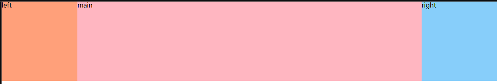
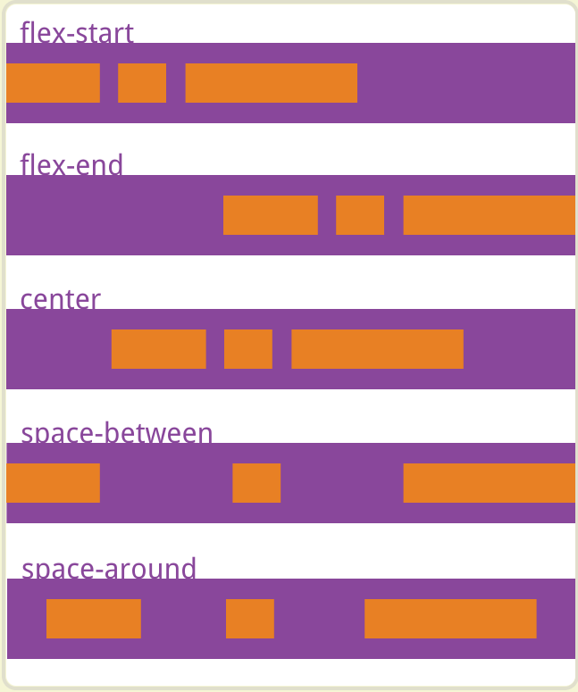

# 盒模型介绍

CSS3中的盒模型有以下两种：
1. 标准盒模型
2. IE（替代）盒模型

两种盒子模型都是由`content + padding + border + margin` 构成，其大小都是由`content + padding + border`决定的，但是盒子的内容宽/高度（即`width/height`）的计算范围根据盒模型的不同会有所不同：

- 标准盒模型：只包含`content`
- IE（替代）盒模型：`content + padding + border`

可以通过`box-sizing`来改变元素的盒模型
- `box-sizing: content-box`：标准盒模型（默认值）
- `box-sizing: border-box`：IE（替代）盒模型

# CSS选择器和优先级

|选择器|示例|
|-|-|
|类型选择器|`h1 {}`|
|通配选择器|`* {}`|
|类选择器|`.box {}`|
|ID选择器|`#unique {}`|
|标签属性选择器|`a[title] {}`|
|伪类选择器|`p:first-child {}`|
|伪元素选择器|`p::first-line {}`|
|后代选择器|`article p`|
|子代选择器|`article > p`|
|相邻兄弟选择器|`h1 + p`|
|通用兄弟选择器|`h1 ~ p`|

通常来说，样式的优先级一般为`!important > style（内联样式 ） > ID选择器 > 类（class）选择器 > 标签选择器`，但是涉及多类选择器作用于一个元素的时候怎么判断优先级呢？在改一些第三方库（比如antd）样式时，理解这个会帮助很大。

优先级是由`A`, `B`, `C`, `D`的值来决定的，其中它们的值计算规则如下：

1. 如果存在内联样式，那么 `A = 1`，否则`A = 0`
2. `B`的值等于`ID选择器`出现的次数
3. `C`的值等于`类选择器`和`属性选择器`和`伪类`出现的总次数
4. `D`的值等于`标签选择器`和`伪元素`出现的总次数

例如：
`#nav-global > ul > li > a.nav-link`

套用上面的算法，一次求出`A`, `B`, `C`, `D`的值：
1. 因为没有内联样式，所以`A = 0`
2. ID选择器总共出现了1次，`B = 1`
3. 类选择器出现了1次，属性选择器出现了0次，伪类选择器出现了0次，所以`C = (1 + 0 + 0) = 1`
4. 标签选择器出现了3次，伪元素出现了0次，所以`D = (3 + 0) = 3`

练习：

```
li                                  /* (0, 0, 0, 1) */
ul li                               /* (0, 0, 0, 2) */
ul ol+li                            /* (0, 0, 0, 3) */
ul ol+li                            /* (0, 0, 0, 3) */
h1 + *[REL=up]                      /* (0, 0, 1, 1) */
ul ol li.red                        /* (0, 0, 1, 3) */
li.red.level                        /* (0, 0, 2, 1) */
a1.a2.a3.a4.a5.a6.a7.a8.a9.a10.a11  /* (0, 0, 11, 0) */
#x34y                               /* (0, 1, 0, 0) */
li:first-child h2 .title            /* (0, 0, 2, 2) */
#nav .selected > a:hover            /* (0, 1, 2, 1) */
html body #nav .selected > a:hover  /* (0, 1, 2, 3) */

```

 比较连个优先级高低的规则是: 从左往右依次进行比较 ，较大者胜出，如果相等，则继续往右移动一位进行比较 。如果4位全部相等，则后面的会覆盖前面的

**优先级的特殊情况**

经过上面的优先级计算规则，我们可以知道内联样式的优先级是最高的，但是外部样式有没有什么办法覆盖内联样式呢？有的，那就要 `!important` 出马了。因为一般情况下，很少会使用内联样式 ，所以 `!important` 也很少会用到！如果不是为了要覆盖内联样式，建议尽量不要使用 `!important` 。、

*注意：如果在内联样式中使用了`!important`，那么外部样式无论怎样都不能覆盖内联样式，因此千万不要在内联样式中使用`!important`*

# 重排（reflow）和重绘（repaint）的理解

- 重排：无论通过什么方式影响了元素的**几何信息**（元素在视口内的位置和尺寸大小），浏览器需要**重新计算**元素在视口内的几何属性，这个过程叫做重排。
- 重绘：通过构造渲染树和重排（回流）阶段，我们知道了哪些节点是可见的，以及可见节点的样式和具体的几何信息（元素在视口内的位置和尺寸大小），接下来就可以将渲染树的每个节点都转换为屏幕上的**实际像素**，这个阶段就叫做重绘。

**如何减少重排和重绘**？

- 最小化重绘和重排：比如样式集中改变，使用添加新样式类名`.class`或`cssText`
- 批量操作DOM：比如读取某元素`offsetWidth`属性存到一个临时变量，再去使用，而不是频繁使用这个计算属性；又比如利用`document.createDocumentFragment()`来添加要被添加的节点，处理完之后再插入到实际DOM中
- 使用`absolute`或`fixed`使元素脱离文档流，这在制作复杂的动画时对性能的影响比较明显
- 开启GPU加速：利用css属性`tranform`、`will-change`等，比如改变元素的位置，我们使用`translate`会比使用绝对定位改变其`left`、`top`等来的高效，因为它不会触发重排或重绘，`transform`使浏览器为元素创建一个GPU图层，这使得动画元素在一个独立的图层进行渲染。当元素的内容没有发生改变，就没有必要进行重绘。

## 浏览器的渲染过程


从上图可以看到，浏览器的渲染过程如下：

1. 解析HTML，生成DOM树；解析CSS，生成CSSOM树
2. 将DOM树和CSSOM树，生成渲染树（Render Tree）
3. Layout/Reflow（回流）：根据生成的渲染树，进行回流，得到节点的几何信息（位置，大小）
4. Painting（重绘）：根据渲染树以及回流得到的几何信息，得到节点的绝对像素
5. Display：将像素发送给GPU，展示在页面上。（这一步其实还有很多内容，比如会在GPU将多个层合并为同一个层，并展示在页面中。而CSS3硬件加速的原理则是新建合成层）

### 生成渲染树


为了构建渲染树，浏览器主要完成了以下工作：
1. 从DOM树的根节点开始遍历每个可见节点
2. 对于每个可见的节点，找到CSSOM树中对应的规则，并应用它们
3. 根据每个可见节点以及其对应的样式，组合生成渲染树

第一步中，既然说了要遍历可见的节点，那么我们得先知道，什么节点是不可见的。不可见的节点包括：
- 一些不会渲染输出的节点：比如`script`, `meta`, `link`等
- 一些通过css进行隐藏的节点。比如`display: none`。注意，利用`visibility`和`opacity`隐藏的节点，还是会显示在渲染树上的。只有`display: none`的节点才不会显示在渲染树上。

从上图来说，我们可以看到`span`标签的样式有一个`display: none`，因此，它最终并没有显示在渲染树上。

*注意：渲染树只包含可见的节点*


**回流**

前面我们通过构造渲染树，我们将可见的DOM节点以及它对应的样式结合起来，可是我们还需要计算它们在设备视口（viewport）内的确切位置和大小，这个计算阶段就是回流。

为了弄清每个对象在网站上的确切大小和位置，浏览器从渲染树的根节点开始遍历，我们可以以下面这个实例来表示：

```html
<!DOCTYPE html>
<html>
  <head>
    <meta name="viewport" content="width=device-width, initial-scale=1">
    <title>Reflow</title>
  </head>
  <body>
    <div style="width: 50%">
      <div style="width: 50%">Hello World!</div>
    </div>
  </body>
</html>

```

我们可以看到，第一个div节点将节点的显示尺寸设置为视口宽度的50%，第二个div将其尺寸设置为父节点的50%。而在回流这个阶段，我们就需要根据视口具体的宽度，将其转为实际的像素值。


**重绘**

最终，我们通过构造渲染树和回流阶段，我们知道了哪些节点是可见的，以及可见节点的样式和具体的几何信息（位置、大小），那么我们就可以将渲染树的每个节点都转换为屏幕上的实际像素，这个阶段就叫做重绘节点。

### 何时发生回流重绘

我们前面知道了，回流这一阶段主要是计算节点的位置和几何信息，那么当页面布局和几何信息发生变化的时候，就需要回流。比如以下情况：
- 添加或删除可见DOM元素
- 元素的位置发生变化
- 元素的尺寸发生变化（包括外边距、内边框、边框大小、高度和宽度等）
- 内容发生变化，比如文本变化或图片被另一个不同尺寸的图片所替代
- 页面一开始渲染的时候（这个无法避免）
- 浏览器的窗口尺寸变化（因为回流是根据视口的大小来计算元素的位置和大小的）

*注意：回流一定会触发重绘，而重绘不一定会回流*

根据改变的范围和程度，渲染树中或大或小的部分需要重新计算，有些改变会触发整个页面的重排，比如，滚动条出现的时候或者修改了根节点

### 浏览器的优化机制

由于每次重排都造成额外的计算消耗，因此大多数浏览器都会通过队列化修改并批量执行来优化重排过程。浏览器会将修改操作放入到队列里，直到过了一段时间或操作达到了一个阈值，才清空队列。但是，**当你获取布局信息的操作的时候，会强制队列刷新**，比如当你访问以下属性或使用以下方法：

- offsetTop、offsetLeft、offsetWidth、offsetHeight
- scrollTop、scrollLeft、scrollWidth、scrollHeight
- clientTop、clientLeft、clientWidth、clientHeight
- getComputedStyle()
- getBoundingClientRect
- 具体可以访问这个网站：[https://gist.github.com/paulirish/5d52fb081b3570c81e3a](https://gist.github.com/paulirish/5d52fb081b3570c81e3a)

以上属性和方法都需要返回最新的布局信息，因此浏览器不得不清空队列，触发回流重绘来返回正确的值。因此，我们在修改样式的时候，最好避免使用上面列出的属性，它们都会刷新渲染队列。如果要使用它们，最好将值缓存起来。
### 减少回流和重绘

#### 最小化重绘和重排

由于重绘和重排可能代价比较昂贵，因此最好就是可以减少它的发生次数。为了减少发生次数，我们可以合并多次对DOM和样式的修改，然后一次处理掉。考虑这个例子

```js
const el = document.getElementById("div");
el.style.padding = "5px";
el.style.borderLeft = "1px";
el.style.borderRight = "2px";
```

例子中，有三个样式属性被修改了，每一个都会影响元素的几何结构，引起回流。当然，大部分现代浏览器都对其做了优化，因此，只会触发一次重排。但是如果在旧版的浏览器或者在上面代码执行的时候，有其他代码访问了布局信息(上文中的会触发回流的布局信息)，那么就会导致三次重排。

因此，我们可以合并所有的改变然后依次处理，比如我们可以采取一下的方式：

- 使用cssText

```js
const el = document.getElementById("div");
el.style.cssText += "border-left: 1px; border-right: 2px; padding: 5px;";
```

- 修改CSS的class

```js
const el = document.getElementById("div");
el.className += " active";
```

#### 批量修改DOM

当我们需要对DOM对一系列修改的时候，可以通过以下步骤减少回流重绘次数：
1. 使元素脱离文档流
2. 对其进行多次修改
3. 将元素带回到文档中

该过程的第一步和第三部可能引起回流，但是经过第一步之后，对DOM的所有修改都不会引起回流重绘，因为它已经不在渲染树了。

有三种方式可以让DOM脱离文档流：
- 隐藏元素，应用修改，重新显示
- 使用文档片段（document fragment）在当前DOM之外构建一个子树，再把它拷贝回文档
- 将原始元素拷贝到一个脱离文档的节点中，修改节点后，再替换原始的元素

考虑我们要执行一段批量插入节点的代码：

```js
function appendDataToElement(appendToElement, data) {
  let li;
  for (let i = 0; i < data.length; i++) {
    li = document.createElement("li");
    li.textContent = "text";
    appendToElemnt.appendChild(li);
  }
}

const ul = document.getElementById("list");
appendDataToElement(ul, data);
```

如果我们直接这样执行的话，由于每次循环都会插入一个新的节点，会导致浏览器回流一次。

我们可以使用这三种方式进行优化：

1. 隐藏元素，应用修改，重新显示

这个会在展示和隐藏节点的时候，产生两次回流

```js
function appendDataToElement(appendToElement, data) {
  let li;
  for (let i = 0; i < data.length; i++) {
    li = document.createElement("li");
    li.textContent = "text";
    appendToElement.appendChild(li);
  }
}

const ul = document.getElementById("list");
ul.style.display = "none";
appendDataToElement(ul, data);
ul.style.display = "block";
```

2. 使用文档片段（document fragment）在当前DOM之外构建一个子树，再把它拷贝回文档

```js
const ul = document.getElementById("list");
const fragment = document.createDocumentFragment();
appendDataToElement(fragment, data);
ul.appendChild(fragment);
```

3. 将原始元素拷贝到一个脱离文档流的节点中，修改节点后，再替换原始的元素

```js
const ul = document.getElementById('list');
const clone = ul.cloneNode(true);
appendDataToElement(clone, data);
ul.parentNode.replaceChild(clone, ul);
```

#### 避免触发同步布局事件

上文我们说过，当我们访问元素的一些属性的时候，会导致浏览器强制清空队列，进行强制同步布局。比如我们想将一个p标签数组的宽度赋值为一个元素的宽度，我们可能写出这样的代码：

```js
function initP() {
  for (let i = 0; i < paragraphs.length; i++) {
    paragraphs[i].style.width = box.offsetWidth + "px";
  }
}
```

这段代码看上去没有什么问题，可是其实会造成很大的性能问题。每次在循环的时候，都读取了box的一个offsetWidth属性值，然后利用它来更新p标签的width属性。这就导致了每一次循环的时候，浏览器都必须先使上一次循环中的样式更新操作生效，才能响应本次循环的样式读取操作。**每一次循环都会强制浏览器刷新队列**。我们可以优化为：

```js
const width = box.offsetWidth;
function initP () {
  for (let i = 0; i < paragraphs.length; i++) {
    paragraphs[i].style.width = width + 'px';
  }
}
```

#### 对于复杂的动画效果，使用绝对定位让其脱离文档流

对于复杂动画效果，由于会经常的引起回流重绘，因此，我们使用绝对定位，让它脱离文档流。否则会引起父元素以及后续元素频繁的回流。

#### css3硬件加速（GPU加速）

比起考虑如何减少回流重绘，我们更期望的是，根本不要回流重绘。这个时候，就需要css3硬件加速了

1. 使用css3硬件加速，可以让`transfrom`、`opacity`、`filters`这些动画不会引起回流重绘
2. 对于动画的其它属性，比如background-color这些，还是会引起回流重绘的，不过它还是可以提升这些动画的性能。

**如何使用**

常见的触发硬件加速的css属性：

- transform
- opacity
- filters
- will-change

**css3硬件加速的坑**

当然，任何美好的东西都是会有对应的代价的，过犹不及。css3硬件加速还是有坑的:

- 如果你为太多元素使用css3硬件加速，会导致内存占用较大，会有性能问题
- 在GPU渲染字体会导致抗锯齿无效。这是因为GPU和CPU的算法不同。因此如果你不在动画结束的时候关闭硬件加速，会产生字体模糊

# 对BFC的理解

BFC（Block Formatting Contexts）即块级格式上下文，根据盒模型可知，每个元素都被定义为一个矩形盒子，然而盒子的布局会受到**尺寸，定位，盒子的子元素或兄弟元素，视口的尺寸**等因素决定，所以这里有一个浏览器计算的过程，计算的规则就是由一个叫做**视觉格式化模型**的东西所定义的，BFC就是来自这个概念，它是CSS视觉渲染的一部分，**用于决定块级盒的布局及浮动相互影响范围的一个区域**。

BFC具有一些特性：

1. 块级元素会在垂直方向一个接一个的排列，和文档流的排列方式一致
2. 在BFC中上下相邻的两个容器的`margin`会重叠，创建新的BFC可以避免外边距重叠
3. 计算BFC的高度时，需要计算浮动元素的高度
4. BFC区域不会与浮动的容器发生重叠
5. BFC是独立的容器，容器内部元素不会影响外部元素
6. 每个元素的左`margin`值和容器的左`border`相接触

利用这些特性，我们可以解决以下问题：
- 利用`4`和`6`，我们可以实现三栏（或两栏）自适应布局
- 利用`2`，我们可以避免`margin`重叠问题
- 利用`3`，我们可以避免高度塌陷

创建BFC的方式：
- 绝对定位元素（`position`为`absolute`或`fixed`）
- 行内块元素，即`display`为`inline-block`
- `overflow`的值不为`visible`

## 视觉格式化模型

**CSS视觉格式化模型**描述了盒子是怎样生成的，简单来说，它定义了盒子生成的计算规则，通过规则将文档元素转换为一个个盒子。

每一个盒子的布局由`尺寸`、`类型`、`定位`、`盒子的子元素或兄弟元素`、`视口的尺寸和位置`等因素决定

视觉格式化模型的计算，取决于一个矩形的边界，这个矩形边界，就是`包含块`（containing block），比如：

```js
<table>
  <tr>
    <td></td>
  </tr>
</table>
```

上述代码片段中，`table`和`tr`都是包含块，`table`是`tr`的包含块，同时`tr`又是`td`的包含块

需要注意的是，**盒子不受包含块的限制，当盒子的布局跑到包含块的外面时，就是我们说的溢出（overflow）**

视觉格式化模型定义了盒（box）的生成，其中的盒主要包括了`块级盒`，`行内盒`和`匿名盒`


### 块级元素

`CSS`属性值`display`为`block`，`list-item`，`table`的元素

### 块级盒

块级盒具有以下特性：
- `css`属性值`display`为`block`，`list-item`，`table`时，它就是块级元素
- 视觉上，块级盒呈现竖直排列的块
- 每个块级盒都会参与BFC的创建
- 每个块级元素都会至少生成一个块级盒，称为主块级盒；一些元素可能会生成额外的块级盒，比如`<li>`，用来存放项目符号


### 行内级元素

CSS属性值`display`为`inline`，`inline-block`，`inline-table`的元素

### 行内盒

行内盒具有以下特性：
- `CSS`属性值`display`为`inline`，`inline-block`，`inline-table`时，它就是行内级元素
- 视觉上，行内盒与其它行内级元素排列为多行
- 所有的可替换元素（`display`值为`inline`，如``, `<iframe>`, `<video>`, `<embed>`等）生成的盒都是行内盒，它们会参与`IFC`（行内格式化上下文）的创建
- 所有的非可替换行内元素（`display`值为`inline-block`或`inline-table`）生成盒称为**原子行内级盒**，不参与`IFC`创建

### 匿名盒

匿名盒指不能被CSS选择器选中的盒子，比如：

```html
<div>
  匿名盒1
  <p>块盒</p>
  匿名盒2
</div>
```

上述代码片段中，`div`元素和`p`元素都会生成一个块级盒，`p`元素的前后会生成两个匿名盒

匿名盒所有可继承的CSS属性值都为`inherit`，所有不可继承的CSS属性值都为`initial`


## 定位方案

**CSS页面布局技术**允许我们拾取网页中的元素，并且控制它们相对正常布局流（普通流）、周边元素、父容器或者主视口/窗口的位置。技术布局从宏观上来说受定位方案影响，定位方案包括`普通流`（Normal Flow，也叫常规流，正常布局流），`浮动`（Float），`定位技术`（Position）

### 普通流

浏览器默认的`HTML`布局方式，此时浏览器不对页面做任何布局控制

当`position`为`static`或`relative`，并且`float`为`none`时会触发普通流，普通流有以下特性：
- 普通流中，所有的盒一个接一个排列
- `BFC`中，盒子会竖着排列
- `IFC`中，盒子会横着排列
- 静态定位中（`position`为`static`），盒的位置就是普通流里布局的位置
- 相对定位中（`position`为`relative`），盒的偏移位置由`top`, `right`, `bottom`, `left`定义，**即使有偏移，仍然保留原有的位置，其它普通流不能占用这个位置）

### 浮动

 - 浮动定位中，盒称为浮动盒（Floating Box）
 - 盒位于当前行的开头或结尾
 - 普通流会环绕在浮动盒周围，除非设置`clear`属性

### 定位技术

1. 静态定位

`position: static`：该关键字指定元素使用正常的布局行为，即元素在文档常规流中当前的布局位置，此时`top`, `right`, `bottom`, `left` 和 `z-index`属性无效

2. 相对定位

`position: relative`：该关键字下，元素先放置在未添加定位时的位置，再在不改变页面布局的前提下调整元素位置（因此会在此元素未添加定位时所在位置留下空白）。

3. 绝对定位

`position: absolute`：元素会被移出正常的文档流，并不为元素预留空间，通过指定元素相对于最近的非`static`定位祖先元素（因为默认所有元素都是static定位）的偏移，来确定元素的位置。绝对定位的元素可以设置外边距（margins），且不会与其它边距合并。

4. 固定定位

`position: fixed`： 元素会被移出正常文档流，并不为元素预留空间，而是通过指定元素相对于屏幕视口（viewport）的位置来指定元素位置。元素的位置在屏幕滚动时不会改变。打印时，元素会出现在每页的固定位置。`fixed`属性会创建新的层叠上下文。当元素祖先的`transform`, `perspective`或`filter`属性非`none`时，容器由视口改为该祖先。

5. 粘性定位

`position: sticky`：元素根据正常文档流进行定位，然后相对它最近*滚动祖先（nearest scrolling ancestor）*和containing block（最近块级祖先nearest block-level ancestor），包括table-related元素，基于`top`, `right`, `bottom`, `left`的值进行偏移。偏移值不会影响任何其它元素的位置。

该值总是创建一个新的*层叠上下文（stacking context）*，注意，一个`sticky`元素会“固定”在离它最近的一个拥有“滚动机制”的祖先上（当该祖先的`overflow`是`hidden`, `scroll`, `auto` 或`overlay`时），即便这个祖先不是最近的真实可滚动祖先。这有效地抑制了任何"sticky"行为

## BFC（块级格式上下文）

通过对CSS盒模型，定位，布局等信息的了解，我们知道BFC这个概念其实来自于**视觉格式化模型**

它是页面CSS视觉渲染的一部分，用于决定块级盒的布局及浮动相互影响范围的一个区域

### BFC的创建

一下元素会创建BFC:
- 根元素（`<html>`）
- 浮动元素（`float`不为`none`）
- 绝对定位元素（`position`为`absolute`或`fixed`）
- 表格的标题和单元格（`display`为`table-caption`，`table-cell`）
- `overflow`的值不为`visible`的元素
- 弹性元素（`display`为`flex`或`inline-flex`的元素的直接子元素）
- 网格元素（`display`为`grid`或`inlien-grid`的元素的直接子元素）

块格式上下文对浮动定位与清除浮动都很重要。浮动定位和清除浮动时只会应用于同一个BFC内的元素。浮动不会影响其它BFC中元素的布局，而清除浮动只能清除同一BFC中在它前面的元素的浮动。外边距折叠（Margin collapsing）也只会发生在属于同一BFC的块级元素之间。

以上是 `CSS2.1` 规范定义的 `BFC` 触发方式，在最新的 `CSS3` 规范中，弹性元素和网格元素会创建 `F(Flex)FC` 和 `G(Grid)FC`。

### BFC的范围

BFC包含创建它的元素的所有子元素但是不包括创建了新的BFC的子元素的内部元素

简单来说，子元素如果又创建了一个新的 BFC，那么它里面的内容就不属于上一个 BFC 了，这体现了 BFC 隔离 的思想，我们还是以 table 为例：

```html
<table>
  <tr>
    <td></td>
  </tr>
</table>
```

假设 table 元素创建的 BFC 我们记为 BFC_table，tr 元素创建的 BFC 记为 BFC_tr，根据规则，两个 BFC 的范围分别为：

- BFC_tr：td 元素
- BFC_table：只有 tr 元素，不包括 tr 里的 td 元素

也就是所说，**一个元素不能同时存在于两个 BFC 中。**

### BFC的特新

BFC 除了会创建一个隔离的空间外，还具有以下特性：
1. BFC 内部的块级盒会在垂直方向上一个接一个排列


2. 同一个 BFC 下的相邻块级元素可能发生外边距折叠，创建新的 BFC 可以避免的外边距折叠


3. 每个元素的外边距盒（margin box）的左边与包含块边框盒（border box）的左边相接触（从右向左的格式化，则相反），即使存在浮动也是如此


4. 浮动盒的区域不会和 BFC 重叠


5. 计算 BFC 的高度时，浮动元素也会参与计算


### BFC的应用

#### 自适应多栏布局

利用特性`3`和`4`，中间栏创建BFC，左右栏宽度固定后浮动。由于**盒子的margin box的左边**和**包含块border box的左边**相接触，同时**浮动盒的区域不会和BFC重叠**，所以中间栏的宽度会自适应。


#### 防止外边距折叠

利用特性`2`，创建新的BFC,让相邻的块级盒位于不同BFC下可以防止外边距折叠。


#### 清除浮动

利用特性`5`，BFC内部的浮动元素也会参与高度计算，可以清除BFC内部的浮动


# 实现两栏布局（左侧固定+右侧自适应布局）

现在有以下DOM结构：

```html
<div class="outer">
  <div class="left">左侧</div>
  <div class="right">右侧</div>
</div>
```

1. 利用浮动，左边元素宽度固定，设置向左浮动，将右边元素的`margin-left`设为固定宽度。注意，因为右边元素的`width`默认为`auto`，所以会自动撑满父元素。

```css
.outer {
  height: 100px;
}

.left {
  float: left;
  width: 200px;
  height: 100%;
  background: lightcoral;
}

.right {
  margin-left: 200px;
  height: 100%;
  background: lightseagreen;
}
```


2. 同样利用浮动，左边元素宽度固定，设置向左浮动。右侧元素设置`overflow: hidden;`这样右边就触发了`BFC`，`BFC`的区域不会与浮动元素发生重叠，所以两侧就不会发生重叠。

```css
.outer {
  height: 100px;
}

.left {
  float: left;
  width: 200px;
  height: 100%;
  background: lightcoral;
}

.right {
  overflow: auto;
  height: 100%;
  background: lightseagreen;
}
```


3. 利用`flex`布局，左边元素固定宽度，右边的元素设置为`flex: 1`。

```css
.outer {
  display: flex;
  height: 100px;
}

.left {
  width: 200px;
  height: 100%;
  background: lightcoral;
}

.right {
  flex: 1; /*相当于 flex: 1 1 0;*/
  height: 100%;
  background: lightseagreen;
}
```

4. 利用绝对定位，父级元素设为相对定位（`relative`）。左边元素`absoulute`定位，宽度固定。右边元素的`margin-left`的值设为左边元素的宽度值。

```css
.outer {
  position: relative;
  height: 100px;
}

.left {
  postion: absolute;
  width: 200px;
  height: 100%;
  background: lightcoral;
}

.right {
  margin-left: 200px;
  height: 100%;
  background: lightseagreen;
}
```


5. 利用绝对定位（`absolute`），父级元素设置相对定位（`relative`）。左边元素宽度固定，右边元素`absolute`定位，`left`为宽度大小，其余方向定位为`0`。

```css
.outer {
	position: relative;
	height: 200px;
}

.left {
	width: 200px;
	height: 100%;
	background: lightcoral;
}

.right {
	position: absolute;
	left: 200px;
	right: 0;
	top: 0;
	bottom: 0;
	height: 100%;
	background: lightseagreen;
}
```


# 实现圣杯布局和双飞翼布局（经典三分栏布局）

圣杯布局和双飞翼布局的目的：

- 三栏布局，中间一栏最先加载和渲染（内容最重要，这就是为什么还需要了解这种布局的原因）。
- 两侧内容固定，中间内容随着宽度自适应。
- 一般用于 PC 网页。

圣杯布局和双飞翼布局的技术总结：

- 使用 `float`  布局。
- 两侧使用 `margin` 负值，以便和中间内容横向重叠。
- 防止中间内容被两侧覆盖，圣杯布局用 `padding` ，双飞翼布局用 `margin` 。

## 圣杯布局

```html
<div id="container" class="clearfix">
  <p class="center">我是中间</p>
  <p class="left">我是左边</p>
  <p class="right">我是右边</p>
</div>
```

```css
#container {
  padding-left: 200px;
  padding-right: 150px;
  overflow: auto;
}
#container p {
  float: left;
}
.center {
  width: 100%;
  background-color: lightcoral;
}
.left {
  width: 200px;
  position: relative;
  left: -200px;
  margin-left: -100%;
  background-color: lightcyan;
}
.right {
  width: 150px;
  margin-right: -150px;
  background-color: lightgreen;
}
.clearfix:after {
  content: "";
  display: table;
  clear: both;
}
```


## 双飞翼布局

```html
<div id="main" class="float">
  <div id="main-wrap">main</div>
</div>
<div id="left" class="float">left</div>
<div id="right" class="float">right</div>

```

```css
.float {
  float: left;
}
#main {
  width: 100%;
  height: 200px;
  background-color: lightpink;
}
#main-wrap {
  margin: 0 190px 0 190px;
}
#left {
  width: 190px;
  height: 200px;
  background-color: lightsalmon;
  margin-left: -100%;
}
#right {
  width: 190px;
  height: 200px;
  background-color: lightskyblue;
  margin-left: -190px;
}

```





**tips：上述代码中 `margin-left: -100%`  相对的是父元素的 `content`  宽度，即不包含 `paddig` 、 `border`  的宽度。**

# 水平垂直居中的多种实现方式

1. 利用绝对定位，设置`left: 50%`和`top: 50%`先将子元素左上角移到父元素中心位置，然后再通过`translate`来调整子元素的中心点到父元素的中心。该方法可以**不定宽高**

```css
.father {
  position: relative;
}

.son {
  position: absolute;
  left: 50%;
  top: 50%;
  transform: translate(-50%, -50%);
}
```

2. 利用绝对定位，子元素的所有方向都为`0`，将`margin`设置为`auto`，由于宽高固定，对应方向实现平分，该方法必须**盒子有宽高**

```css
.father {
  position: relative;
}

.son {
  position: absolute;
  top: 0;
  left: 0;
  right: 0;
  bottom: 0;
  margin: auto;
  height: 100px;
  width: 100px;
}
```

3. 利用绝对定位，设置`left: 50%`和`top: 50%`先将子元素移到父元素中心位置，然后再通过`margin-left`和`margin-top`以子元素自己的一半宽高进行负值赋值。该方法**必须定宽高**

```css
.father {
  position: relative;
}

.son {
  position: absolute;
  left: 50%;
  top: 50%;
  width: 200px;
  height: 200px;
  margin-left: -100px;
  margin-top: -100px;
}
```

4. 利用`flex`

```css
.father {
  display: flex;
  justify-content: center;
  align-items: center;
}
```

5. 利用`grid`布局

```css
.father {
  display: grid;
}

.son {
  margin: auto;
}
```

## 图片定高|不定高水平垂直居中

1. `display: table-cell`

```css
.parent {
  display: table-cell;
  text-align: center;
  vertical-align: middle;
  font-size: 0;
}
```

2. `::after` 或`::before`

```css
.parent {
  text-align: center;
}

.parent::after { /*::befores*/
  content: "";
  display: inline-block;
  vertical-align: middle;
  height: 100%;
}

img {
  vertical-align: middle;
}
```


# line-height如何继承？

- 父元素的`line-height`写了**具体数值**，比如`30px`，则子元素`line-height`继承该值。
- 父元素的`line-height`写了**比例**，比如`1.5`或`2`，则子元素`line-height`也是继承该比例。
- 父元素的`line-height`写了**百分比**，比如`200%`，则子元素`line-height`继承的是父元素`font-size * 200%`计算出来的值。


# flex布局


Flex是Flexible Box的缩写，意为“弹性布局”，用来为盒状模型提供最大的灵活性。

任何一个容器都可以指定为Flex布局

```css
.box {
  display: flex;
}
```

行内元素也可以使用Flex布局

```css
.box {
  display: inline-flex;
}
```

*注意：设为Flex布局以后，子元素的`float`, `clear` 和 `vertical-align`属性将失效。*

## 基本概念

采用Flex布局的元素，称为**Flex容器（flex container）**，简称“容器”。它的所有子元素自动成为容器成员，称为**Flex项目（flex item）**，简称“项目”。


容器默认存在两根轴：水平的主轴（main axis）和垂直的交叉轴（cross axis）。主轴的开始位置（与边框的交叉点）叫做`man start`，结束位置叫做`main end`；交叉轴的开始位置叫做`cross start`，结束位置叫做`cross end`。

项目默认沿主轴排列。单个项目占据的主轴空间叫做`main size`，占据的交叉轴空间叫做`cross size`。

## 容器属性

- flex-direction
- flex-wrap
- flex-flow
- justify-content
- align-items
- align-content

### flex-direction属性

`flex-direction`属性决定主轴的方向（即项目的排列方向）

```css
.box {
  flex-direction: row | row-reverse | column | column-reverse;
}
```


它可能有4个值：

- row（默认值）：主轴为水平方向，起点在左端
- row-reverse：主轴为水平方向，起点在右端
- column：主轴为垂直方向，起点在上沿
- column-reverse：主轴为垂直方向，起点在下沿

### flex-wrap属性

默认情况下，项目都排在一条线（又称“轴线”）上。`flex-wrap`属性定义，如果一条轴线排不下，如何换行。


```css
.box {
  flex-wrap: nowrap | wrap | wrap-reverse;
}
```

它可能取三个值：

1. `nowrap`（默认）：不换行


2. `wrap`：换行，第一行在上方


3. `wrap-reverse`：换行，第一行在下方


### flex-flow属性

`flex-flow`属性是`flex-direction`属性和`flex-wrap`属性的简写形式，默认值为`row nowrap`。

```css
.box {
  flex-flow: <flex-direction> || <flex-wrap>;
}
```

### justify-content属性

`justify-content`属性定义了项目在主轴上的对齐方式。

```css
.box {
  justify-content: flex-start | flex-end | center | space-between | space-around;
}
```



它可能取5个值，具体对齐方式与轴的方向有关。下面假设主轴为从左到右。

- flex-start（默认值）：左对齐
- flex-end：右对齐
- center：居中
- space-between：两端对齐，项目之间的间隔都相等
- space-around：每个项目两侧的间隔相等。所以，项目之间的间隔比项目与边框的间隔大一倍

### align-items属性

`align-items`属性定义项目在交叉轴上如何对齐

```css
.box {
  align-items: flex-start | flex-end | center | baseline | stretch;
}
```


它可能取5个值。具体的对齐方式与交叉轴的方向有关，下面假设交叉轴从上到下。

- flex-start：交叉轴的起点对齐
- flex-end：交叉轴的终点对齐
- center：交叉轴的终点对齐
- baseline：项目的第一行文字的基线对齐
- stretch（默认值）：如果项目未设置高度或设为auto，将占满整个容器的高度

### align-content属性

`align-content`属性定义了多根轴线的对齐方式。如果项目只有一根轴线，该属性不起作用。

```css
.box {
  align-content: flex-start | flex-end | center | space-between | space-around | stretch;
}
```


该属性可能取6个值。

- flex-start：与交叉轴的起点对齐
- flex-end：与交叉轴的终点对齐
- center：与交叉轴的中点对齐
- space-between：与交叉轴两端对齐，轴线之间的间隔平均分布
- space-around：每根轴线两侧的间隔都相等，所以，轴线之间的间隔比轴线与边框的间隔大一倍
- stretch（默认值）：轴线占满整个交叉轴

## 项目的属性

以下6个属性设置在项目上。

- order
- flex-grow
- flex-shrink
- flex-basis
- flex
- align-self

### order属性

`order`属性定义项目的排列顺序。数值越小，排列越靠前，默认为0

```css
.item {
  order: <integer>;
}
```


### flex-grow属性

`flex-grow`属性定义项目的放大比例，默认为`0`，即如果存在剩余空间，也不放大。

```css
.item {
  flex-grow: <number>;
}
```


如果所有项目的`flex-grow`属性都为1，则它们将等分剩余空间（如果有的话）。如果一个项目的`flex-grow`属性为2，其它项目都为1，则前者占据的剩余空间将比其它项多一倍。

### flex-shrink属性

`flex-shrink`属性定义了项目的缩小比例，默认为1，即如果空间不择，该项目将缩小。

```css
.item {
  flex-shrink: <number>;
}
```


如果所有项目的`flex-shrink`属性都为1，当空间不足时，都将等比例缩小。如果一个项目的`flex-shrink`属性为0，其它项目都为1，则空间不足时，前者不缩小。负值对该属性无效。

### flex-basis属性

`flex-basis`属性定义了在分配多余空间之前，项目占据的主轴空间（main size）。浏览器根据这个属性，计算主轴是否有多余空间。它的默认值为`auto`，即项目的本来大小。

```css
.item {
  flex-basis: <length> | auto;
}
```

它可以设为跟`width`或`height`属性一样的值（比如350px），则项目将占据固定空间。

### flex属性

`flex`属性是`flex-grow`, `flex-shrink` 和 `flex-basis`的简写，默认值为`0 1 auto`。后两个属性可选。

```css
.item {
  flex: none | [ <'flex-grow'> <'flex-shrink'> ? || <'flex-basis'> ]
}
```

该属性有两个快捷值：`auto`(`1 1 auto`)和`none`(`0 0 auto`)

建议优先使用这个属性，而不是单独写三个分离的属性，因为浏览器会推算相关值。

**还有一个常用值`flex: 1`**，它具体包含了以下的意思：

- `flex-grow: 1`：该属性默认为`0`，如果存在剩余空间，元素也不放大。设置为`1`代表会放大。
- `flex-shrink: 1`：该属性默认为`1`，如果空间不足，元素缩小。
- `flex-basis: 0%`：该属性定义在分配多余空间之前，元素占据的主轴空间。浏览器就是根据这个属性来计算是否有多余空间的。默认值为`auto`，即项目本身大小。设置为`0%`之后，因为有`flex-grow`何`flex-shrink`的设置会自动放大或缩小。在做两栏布局时，如果右边的自适应元素`flex-basis`设为`auto`的话，其本身大小将会是`0`。

> auto 为表示项目本身的大小, 如果设置为 auto, 那么这三个盒子就会按照自己内容的多少来等比例的放大和缩小, 那我们如果随便设置一个其他带有长度单位的数字呢, 那么他就不会按项目本身来计算, 所以它不关心内容, 只是把空间等比收缩和放大

### align-self属性

`align-self`属性允许单个项目有与其它项目不一样的对齐方式，可覆盖`align-items`属性。默认值为`auto`，表示继承父元素的`align-items`属性，如果没有父元素，则等同于`stretch`。

```css
.item {
  align-self: auto | flex-start | flex-end | center | baseline | stretch;
}
```


该属性可能取6个值，除了auto，其它都与align-items属性完全一致。


# Grid网格布局

网格布局（Grid）是最强大的 CSS 布局方案。

它将网页划分成一个个网格，可以任意组合不同的网格，做出各种各样的布局。


上面这样的布局，就是Grid布局的拿手好戏。

Grid 布局与 Flex 布局有一定的相似性，都可以指定容器内部多个项目的位置。但是，它们也存在重大区别。

Flex 布局是轴线布局，只能指定"项目"针对轴线的位置，可以看作是**一维布局**。Grid 布局则是将容器划分成"行"和"列"，产生单元格，然后指定"项目所在"的单元格，可以看作是**二维布局**。Grid 布局远比 Flex 布局强大。

## 基本概念

### 容器和项目

采用网格布局的区域，称为“容器”（container）。容器内部采用网格定位的子元素，称为“项目”（item）

```html
<div>
  <div><p>1</p></div>
  <div><p>2</p></div>
  <div><p>3</p></div>
</div>
```

上面的代码中，最外层的`<div>`元素就是容器，内层的三个`<div>`元素就是项目。

注意：项目只能是容器的顶层子元素，不包含项目的子元素，比如上面代码的`<p>`元素就不是项目。Grid布局只对项目生效。

### 行和列

容器里面的水平区域称为“行”（row），垂直区域称为“列”（column）。


上图中，水平的深色区域就是“行”，垂直的深色区域就是“列”

### 单元格

行和列的交叉区域，称为“单元格”（cell）

正常情况下，`n`行和`m`列会产生`n x m`个单元格。比如，3行3列会产生9九个单元格。

### 网格线

划分网格的线，称为“网格线”（grid line）。水平网格线划分出行，垂直网格线划分出列。

正常情况下，`n`行有`n + 1`根水平网格线，`m`列有`m + 1`根垂直网格线，比如三行就有四根水平网格线。


上图是一个4 x 4的网格，共有5根水平网格线和5根垂直网格线。

## 容器属性

Grid布局的属性分为两类。一类定义在容器上面，称为容器属性；另一类定义在项目上面，称为项目属性。这部分先介绍容器属性。

### display属性

`display: grid`指定一个容器采用网格布局

```css
div {
  display: grid;
}
```


上图是`display: grid`的效果。

默认情况下，容器元素都是块级元素，但也可以设成行内元素。

```css
div {
  display: inline-grid;
}
```

上面代码指定`div`是一个行内元素，该元素内部采用网格布局。


上图是`display: inline-grid`的效果。

*注意：设为网格布局以后，容器子元素（项目）的`float`、`display: inline-block`、`display: table-cell`、`vertical-align`和`column-*`等设置都将失效。*

### grid-template-columns属性，grid-template-rows属性

容器指定了网格布局以后，接着就要划分行和列。`grid-template-columns`属性定义每一列的列宽，`grid-template-rows`属性定义每一行的行高。

```css
.container {
  display: grid;
  grid-template-columns: 100px 100px 100px;
  grid-template-rows: 100px 100px 100px;
}
```

上面代码指定了一个三行三列的网格，列宽和行高都是`100px`。


除了使用绝对单位，也可以使用百分比。

```css
.container {
  display: grid;
  grid-template-columns: 33.3% 33.3% 33.3%;
  grid-template-rows: 33.3% 33.3% 33.3%;
}
```

1. repeat()

有时候，重复写同样的值非常麻烦，尤其网格很多时。这时可以使用`repeat()`函数，简化重复的值。上面的代码用`repeat()`改动如下：

```css
.container {
  display: grid;
  grid-template-columns: repeat(3, 33.3%);
  grid-template-rows: repeat(3, 33.3%);
}
```

`repeat()`接收两个参数，第一个参数是重复的次数（上例是3），第二个参数是所要重复的值。

`repeat()`重复某种模式也是可以的。

```css
{
  grid-template-columns: repeat(2, 100px 20px 8px);
}
```

上面定义了`6`列，第一列和第四列的宽度为`100px`，第二列和第五列为`20px`，第三列和第六列为`80px`。


2. auto-fill关键字

有时，单元格的大小是固定的，但是容器的大小不确定。如果希望每一行（或每一列）容纳尽可能多的单元格，这时可以使用`auto-fill`关键字表示自动填充。

```css
.container {
  display: grid;
  grid-template-columns: repeat(auto-fill, 100px);
}
```

上面代码表示每列宽度`100px`，然后自动填充，直到容器不能放置更多的列。


3. fr关键字

为了方便的表示比例的关系，网格布局提供了`fr`关键字（fraction的缩写，意为“片段”）。如果两列的宽度分别为`1fr`和`2fr`，就表示后者是前者的两倍。

```css
.container {
  display: grid;
  grid-template-columns: 1fr 1fr;
}
```

上面代码表示两个相同宽度的列。


`fr`可以与绝对长度的单位结合使用，这时会非常方便

```css
.container {
  display: grid;
  grid-template-columns: 150px 1fr 2fr;
}
```

上面代码表示，第一列的宽度为150像素，第二列的宽度是第三列的一半。


4. minmax()

`minmax()`函数产生一个长度范围，表示长度就在这个范围之中。它接受两个参数，分别为最小值和最大值。

```css
grid-template-columns: 1fr 2fr minmax(100px, 1fr);
```

上面代码中，`minmax(100px, 1fr)`表示列宽不小于`100px`，不大于`1fr`。

5. auto关键字

`auto`关键字表示有浏览器自己决定长度。

```css
grid-template-columns: 100px auto 100px;
```

上面代码中，第二列的宽度，基本上等于该列单元格的最大宽度，除非单元格内容设置了`min-width`，且这个值大于最大宽度。

6. 网格线的名称

`grid-template-columns`属性和`grid-template-rows`属性里面，还可以使用方括号，指定每一根网格线的名字，方便以后的引用。

```css
.container {
  display: grid;
  grid-template-columns: [c1] 100px [c2] 100px [c3] auto [c4];
  grid-template-rows: [r1] 100px [r2] 100px [r3] auto [r4];
}
```

7. 布局实例

`grid-template-columns`属性对于网页布局非常有用。两栏式布局只需要一行代码。

```css

.wrapper {
  display: grid;
  grid-template-columns: 70% 30%;
}
```

上面代码将左边栏设为70%，右边栏设为30%

传统的十二网格布局，写起来也很容易。

```css
{
  grid-template-columns: repeat(12, 1fr)
}
```

### grid-row=gap属性，grid-column-gap属性，grid-gap属性

`grid-row-gap`属性设置行与行的间隔（行间距），`grid-column-gap`属性设置列与列的间隔（列间距）

```css
.container {
  grid-row-gap: 20px;
  grid-column-gap: 20px;
}
```


# 参考链接

[深入理解CSS选择器优先级](https://juejin.cn/post/6844903709772611592)

[做了一份前端面试复习计划，保熟～](https://juejin.cn/post/7061588533214969892#heading-16)

[你真的了解回流和重绘吗](https://juejin.cn/post/6844903779700047885)

[可能是最好的BFC解析了...](https://juejin.cn/post/6960866014384881671)

[面试官：你能实现多少种水平垂直居中的布局（定宽高和不定宽高）](https://juejin.cn/post/6844903982960214029#comment)

[Flex 布局教程：语法篇](https://www.ruanyifeng.com/blog/2015/07/flex-grammar.html)

[CSS Grid 网格布局教程](https://www.ruanyifeng.com/blog/2019/03/grid-layout-tutorial.html)


