# 数据类型

## 基本的数据类型介绍，及值类型和引用类型的理解

JS中的8种基础类型：
- 7种原始类型：`Undefined`, `Null`, `Boolean`, `Number`, `String`, `Symbol`, `BigInt`
- 1中引用类型：`Object`

其中`Symbol`和`BigInt`是ES6新增的数据类型：
- Symbol代表独一无二的值，最大的用法是用来定义对象的唯一属性名
- BigInt可以表示任意大小的整数

**值类型的复制变动过程如下：**

```js
let a = 100;
let b = a;
a = 200;

console.log(b); // 200
```

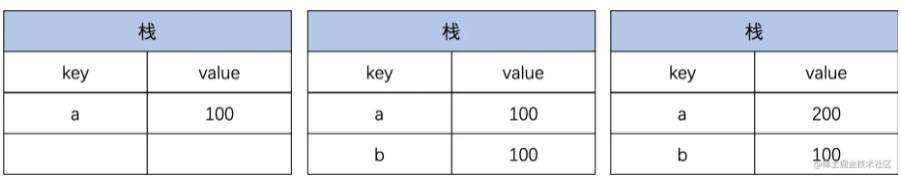

值类型是直接存储在**栈（stack）**中的简单数据段，占据空间小、大小固定，属于被频繁使用的数据，所以放入栈中存储。

**引用类型的赋值变动过程如下：**

```js
let a = {
  age: 20
}
let b = a;
b.age = 300;

console.log(a.age); // 30
```

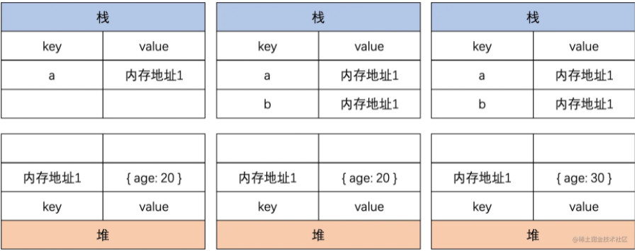

引用类型存储在**堆（heap）**中的对象，占据空间大、大小不固定。如果存储在栈中，将会影响程序运行的性能。

## 数据类型的判断

- typeof: 能判断所有**值类型**， **函数**。不可对**null、对象、数组**进行精确判断，因为都返回`object`

```js
console.log(typeof undefined); // undefined
console.log(typeof 2); // number;
console.log(typeof true); // boolean
console.log(typeof "str"); // string
console.log(typeof Symbol("foo")); // symbol
console.loG(typeof 1111n); // bigint
console.log(typeof function() {}); // function

// 不能判断
console.log(typeof []); // object
console.log(typeof {}); // object
console.log(typeof null); // object
```

- instanceof：能判断**对象**类型，不能判断基本数据类型，**其内部运行机制是判断在其原型链中能否找到该类型的原型**。

```js
class People {}
class Student extends People {}

const s1 = new Student();

console.log(s1 instanceof People); // true
console.log(s1 instanceof Student); // true
```

顺着**原型链**找，如果能找到对应的`xxx.prototype`即为`true`。比如这里的`s1`作为实例，顺着原型链能找到`Student.prototype`及`People.prototype`。

- Object.prototype.toString.call()：所有原始数据类型都能判断，还有**Error对象，Date对象**等。

```js
Object.prototype.toString.call(2); // "[object Number]"
Object.prototype.toString.call(""); // "[object String]"
Object.prototype.toString.call(true); // "[object Boolean]"
Object.prototype.toString.call(undefined); // "[object Undefined]"
Object.prototype.toString.call(null); // "[object Null]"
Object.prototype.toString.call(Math); // "[object Math]"
Object.prototype.toString.call({}); // "[object Object]"
Object.prototype.toString.call([]); // "[object Array]"
Object.prototype.toString.call(function () {}); // "[object Function]"
```

**在面试中有一个经常被问的问题就是：如何判断变量是否为数组？**

```js
Array.isArray(arr); // true
arr.__proto__ === Array.prototype; // true
arr instanceof Array; // true
Object.prototype.toString.call(arr); // "[object Array]"
```

# 手写深拷贝

## 深拷贝和浅拷贝的定义

- 浅拷贝

创建一个新对象，这个对象有着原始对象属性的一份精确拷贝。如果属性是基本类型，拷贝的就是基本类型的值，如果属性是引用类型，拷贝的就是内存地址，所以如果其中一个对象改变了这个地址，就会影响到另一个对象。

- 深拷贝

将一个对象从内存中完整的拷贝一份出来，从堆内存中开辟一个新的区域存放新对象，且修改新对象不会影响原对象。

## 乞丐版

在不使用第三方库的情况下，我们想要深拷贝一个对象，用的最多的就是下面这个方法。

```js
JSON.parse(JSON.stringify());
```

这种写法可以应对大部分的应用场景（如数组，对象），但是它也有缺陷，比如拷贝其它应用类型、拷贝函数、循环引用等情况。

## 基础版本

**浅拷贝版本**：

```js
function shallowCopy(target) {
  let copyTarget = {};
  for (const key in target) {
    copyTarget[key] = target[key];
  }

  return copyTarget;
};
```

创建一个新的对象，遍历需要拷贝的对象，将需要拷贝的对象的属性依次添加到新对象上，最后返回新的对象。

如果是深拷贝的话，考虑到我们要拷贝的对象是不知道有多少深度的，可以用递归来解决问题。稍微改写上面的代码：
- 如果是原始类型，无需继续拷贝，直接返回
- 如果是引用类型，创建一个新的对象，遍历需要克隆的对象，将需要克隆的对象的属性执行**深拷贝后**依次添加到新对象上。

很容易理解，如果有更深层次的对象可以继续递归直到属性为原始类型，这样我们就完成了一个最简单的深拷贝：

```js
function deepCopy(target) {
  if (typeof target === "object") {
    let copyTarget = {};
    for (const key in target) {
      copyTarget[key] = deepCopy(target[key]);
    }

    return copyTarget;
  } else {
    return target;
  }
}
```

**测试用例：**

```js
const target = {
    field1: 1,
    field2: undefined,
    field3: 'ConardLi',
    field4: {
        child: 'child',
        child2: {
            child2: 'child2'
        }
    }
};

```

**测试结果：**

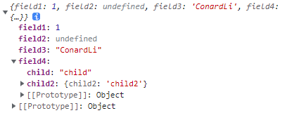

*这是最基础版本的深拷贝，其中还有很多缺陷，比如没有考虑数组的情况*

## 考虑数组

```js
function deepCopy(target) {
  if (typeof target === "object") {
    let copyTarget = Array.isArray(target) ? [] : {};
    for (const key in target) {
      copyTarget[key] = deepCopy(target[key]);
    }

    return copyTarget;
  } else {
    return target;
  }
};
```

**测试用例：**

```js
const target = {
    field1: 1,
    field2: undefined,
    field3: {
        child: 'child'
    },
    field4: [2, 4, 8]
};

```

**测试结果：**

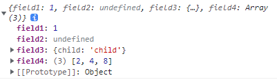


## 循环引用

我们执行下面这样一个测试用例：

```js
const target = {
    field1: 1,
    field2: undefined,
    field3: {
        child: 'child'
    },
    field4: [2, 4, 8]
};
target.target = target;
```

可以看到下面的结果：

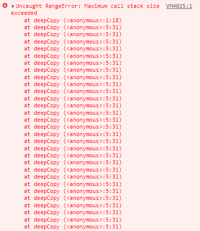

很明显，因为递归进入死循环导致栈内存溢出了。

原因就是上面的对象存在循环引用的情况，即对象的属性间接或直接的引用了自身的情况：

解决循环引用问题，我们可以额外开辟一个存储空间，来存储当前对象和拷贝对象的对应关系，当需要拷贝当前对象时，先去存储空间中找，有没有拷贝过这个对象，如果有的话直接返回，如果没有的话继续拷贝，这样就巧妙化解的循环引用的问题。

这个存储空间，需要可以存储`key-value`形式的数据，且`key`可以是一个引用类型，我们可以选择`Map`这种数据结构：

- 检查`map`中有无拷贝过的对象
- 有-直接返回
- 没有-将当前对象作为`key`，拷贝对象作为`value`进行存储
- 继续拷贝

```js
function deepCopy(target, map = new Map()) {
  if (typeof target === "object") {
    let copyTarget = Array.isArray(target) ? [] : {};
    if (map.get(target)) {
      return map.get(target);
    }
    map.set(target, copyTarget);
    for (const key in target) {
      copyTarget[key] = deepCopy(target[key], map);
    }
    return copyTarget;
  } else {
    return target;
  }
};
```

再次执行上面的测试用例：

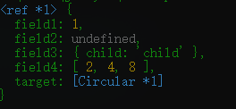

`target`属性变为了一个`Circular`类型，即循环引用的意思。

接下来，我们可以使用，`WeakMap`提代`Map`来使代码达到画龙点睛的作用。

> `WeakMap` 对象是一组键/值对的集合，其中的键是**弱引用**的。其**键必须是对象**，而值可以是任意的。在计算机程序设计中，弱引用与强引用相对，是指不能确保其引用的对象不会被垃圾回收器回收的引用。 一个对象若只被弱引用所引用，则被认为是不可访问（或弱可访问）的，并因此可能在任何时刻被回收。

## 终版

```js
function deepCopy(target, map = new WeakMap()) {
    if (typeof obj === "object") {
      let copyTarget = Array.isArray(target) ? [] : {};
      if (map.get(target)) {
        return map.get(target);
      }
      map.set(target, copyTarget);
      for (const key in target) {
        if (target.hasOwnProperty(key)) { // 保证key不是原型属性
          copyTarget[key] = deepCopy(target[key], map);
        }
      }

      return copyTarget;
    } else {
      return target;
    }
};
```

# 根据 0.1+0.2 ! == 0.3，讲讲 IEEE 754 ，如何让其相等？

## JavaScript是怎么存储数字的————IEEE-754标准

JavaScript的数字是IEEE-754标准存储的双精度浮点数类型。双精度浮点数总共有64为（bit），第一位用于表示符号，接着十一位用于表示阶码，剩余的五十二位用于表示尾数。

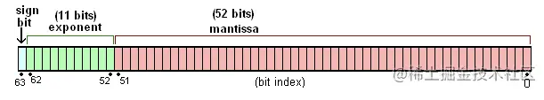

符号位很好理解，0表示正数，1表示负数。阶码和尾数表示什么呢？IEEE-754标准中，一个浮点数将被使用**二进制科学计数法**的方式存储。看下面的公式：

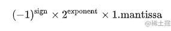

**阶码（exponent）**

表示的是二的多少次方，范围是-1023~1024

阶码是使用**移码**表示法存储的，偏移值为+1023，也就是在阶码运算时需要在二进制运算的基础上，手动减去1023才是真正表达的值。

> **[移码（Offset binary）](https://zh.wikipedia.org/wiki/%E7%A7%BB%E7%A0%81)：**
> 
> 移码是一种将全0码映射为最小负值、全1码映射为最大正值的编码方案。移码没有标准，但通常对于n位二进制数
> 偏移量K = 2<sup>n−1</sup>————这使得真值0的编码的最高位为1、其余位均为0，相当于**补码**表示的最高位（符号位）取反；另外，移码在逻辑比较操作中可以得到和真值比较相同的结果，补码则当且仅当符号相同时逻辑比较操作的结果和真值比较相同，否则比较结果将颠倒（负值比正值大）。在IEEE 754浮点数表示中移码是非标准的，它的偏移值为2<sup>k</sup>-1，也就是说对于单精度浮点数的偏移值为127。

> 移码的由来
> 
> 示例：-120D = -01111000B（真值）
> 
> 原码：11111000 (原码是指一个二进制数左边加上符号位后所得到的码，且当二进制数大于0时，符号位为0；二进制数小于0时，符号位为1；二进制数等于0时，符号位可以为0或1(+0/-0))
> 
> 反码：10000111 (对于单个数值（二进制的0和1）而言，对其进行取反操作就是将0变为1，1变为0)
> 
> 补码：10001000 (正数和0的补码就是该数字本身再补上最高比特0。负数的补码则是将其对应正数按位取反(反码)再加1)
> 
> 移码：00001000 (原数的补码加上偏移值)
> 
>
> 这样的移码也可以叫做偏移值为128的移码，也是标准移码，即10000000B + (-1111000B) = 10000000B + (10001000B) = 00001000B。这样移码就可以表示为**原数的补码加上偏移值**。


```js
01111111111 // 0
10000000000 // 1
11111111110 // 1023
00000000000 // -1024
```

**尾数（mantissa）**

根据公式尾码表示的是小数点后面的部分，整数部分永远是1。这是因为对于任意一个非零数字，第一位有效数字肯定是1，所以标准规定，**第一个1不需要存**

尾码存的是二进制小数的部分，我们需要先弄清楚二进制是怎么表示小数的：

先看十进制的小数是怎么算的：

```js
(0.625)10 = 0 + 6 * 10^-1 + 2 * 10^-2 + 5*10^-3
```

可以看到十进制小数点后第`n`个数字是该数字乘以基数`(10)`的`-n`次方，二进制格式也是一样的道理，只是基数变成2。

```js
(0.101)2 => 0 + 2^-1 + 2^-3 => 十进制的 1/2 + 1/8 = 0.625
```

第二个问题，永远有个隐藏的`1`，那数字`0`是怎么表示的呢？由于阶码表示的是二的多少次方，所表示的数字非常大，大到隐藏的1可以忽略不计。根据标准0的二进制形式为：

```js
0 00000000000 0000000000000000000000000000000000000000000000000000
```

换算成十进制为`2^-1024 * 1.0`，是一个小到可以忽略不计的极小值。

## Number.MAX_SAFE_INTEGER是怎么来的

尾数位数决定了最大的整数范围，在做数值运算时，我们会要求数值以及运算结果必须不能超出 `-Number.MAX_SAFE_INTEGER ~ Number.MAX_SAFE_INTEGER` 的范围。

首先这个范围是怎么来的，尾数总共 52 位，加上不存的 1 总共 53 位，所能表达的最大值是 53 位全是 1

111...111(53 个 1) = 1000...000(53 个 0) - 1 也就是 2^53 - 1。

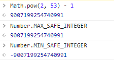

超出范围的时候发生了什么？尾码只有 `52` 位，放不下的部分就溢出了呗，这时候 `UnSafe` 的情况就出现了。看下面的例子：

`9007199254740992` 的二进制形式为：

```js
0 10000110100 0000000000000000000000000000000000000000000000000000
```

而 `9007199254740993` 的二进制形式也是！！！：

```js
0 10000110100 0000000000000000000000000000000000000000000000000000
```

所以如果拿这两个数字判断是否相等，结果当然是 `true`！！！

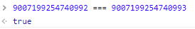

同样的问题还会发生在小数运算，最常见的问题，也是常被拿出来放在面试过程问的，为什么 `0.1 + 0.2 !== 0.3`。

看一下计算机是怎么存储十进制的`0.1`的。

如果是整数，十进制转二进制我们是通过**除二取余**，十进制15转二进制的过程：

```js
15 % 2 === 1, 15 => 7
7 % 2 === 1, 7 => 3
3 % 2 === 1, 3 => 1
1 % 2 === 1, 1 => 0
```

得到15的二进制形式`1111`。小数部分的计算规则和整数不一样，使用的方式是**乘二取整**法，小数0.125转成二进制的过程：

```js
0.125 * 2 => 0.25, 0
0.25 * 2 => 0.5, 0
0.5 * 2 = > 1, 1
```

十进制0.125的二进制形式是`0.001`（2^-3）

掌握了小数的二进制表示法，来看一下十进制 `0.1` 用二进制怎么表示。

```js
0.1 * 2 => 0.2, 0
0.2 * 2 => 0.4, 0
0.4 * 2 => 0.8, 0
0.8 * 2 => 1.6, 1
0.6 * 2 => 1.2, 1
0.2 * 2 => 0.4, 0
...
```

可以看到，`0.1` 用二进制表示为 `0.00011001100110011...`， 出现了 `0011` 的无限循环，第一个有效数字`1`出现在小数点后第四位，把它往前移动四位，阶码为 `-4`，符号位为 `0`，合在一起就得到 `0.1` 的二进制形式：

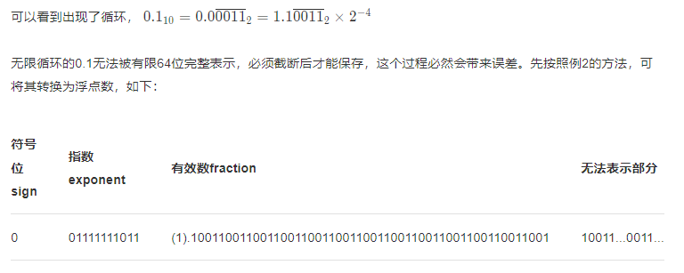


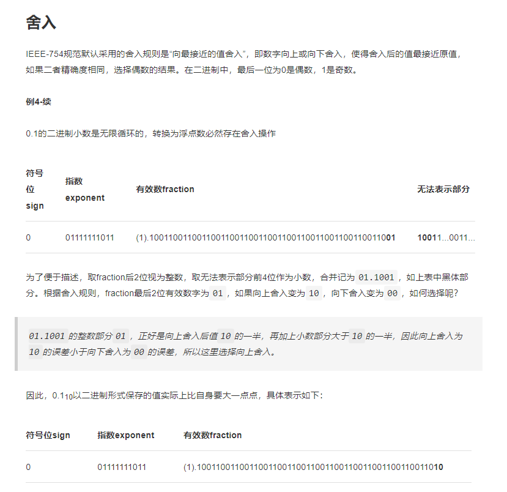

```js
0 01111111011 1001100110011001100110011001100110011001100110011010
```

`0.2` 是 `0.1` 的两倍，尾码保持不动，阶码 `+ 1`，得到 `0.2` 的二进制形式：

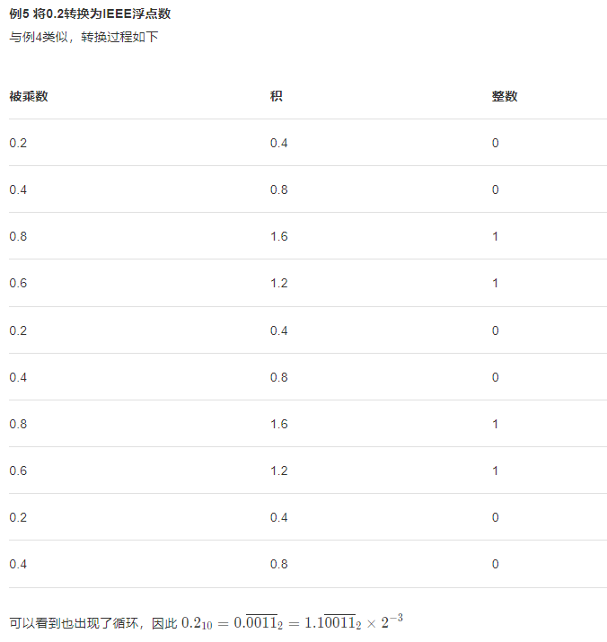

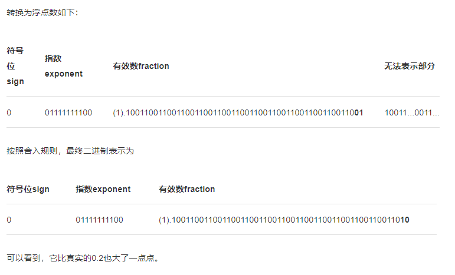

```js
0 01111111100 1001100110011001100110011001100110011001100110011010
```

0.2 的阶码比 0.1 的阶码大一，我们把 0.1 的尾码右移一位，阶码减 1，让两个数的阶码保持一致。

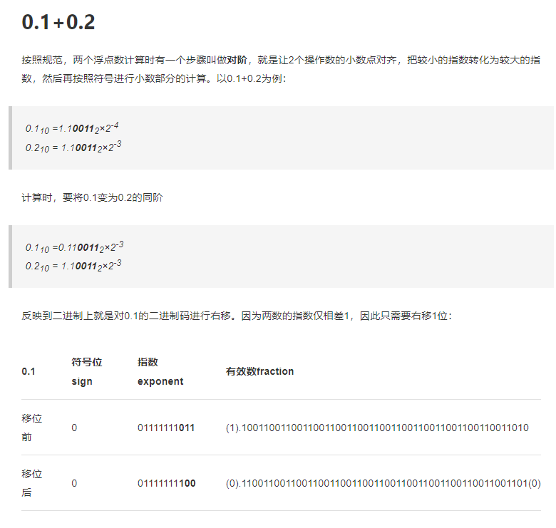

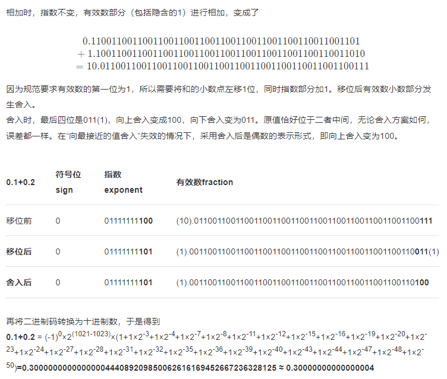

```js
0 01111111100 0.1100110011001100110011001100110011001100110011001101
0 01111111100 1.1001100110011001100110011001100110011001100110011010
```

现在阶码相同了，尾数相加得到：

```js
  0 01111111100  0.1100110011001100110011001100110011001100110011001101
+ 0 01111111100  1.1001100110011001100110011001100110011001100110011010
= 0 01111111100 10.0110011001100110011001100110011001100110011001100111
```

把运算结果按照 `IEEE-754` 标准格式化，需要向右移动一位，阶码加一。但这时候发现，最后一个 1 放不下了，需要舍弃，根据标准当要舍弃一位数时，需要进行`0舍1入`。如果被舍弃的是 0 什么都不用做，如果被舍弃的是1，则需要补回来。

```js
0 01111111101 0011001100110011001100110011001100110011001100110011 1（1 多出，需要舍弃）
0 01111111101 0011001100110011001100110011001100110011001100110100  （补 1）
```

于是，我们得到了 0.1 + 0.2 的运算结果。

```js
0 01111111101 0011001100110011001100110011001100110011001100110100
```

再来，使用乘2取整的方法，算一下 0.3 的二进制是怎么表示的。

```js
0.3 * 2 => 0.6, 0
0.6 * 2 => 1.2, 1
0.2 * 2 => 0.4, 0
0.4 * 2 => 0.8, 0
0.8 * 2 => 1.6, 1
0.6 * 2 => 1.2, 1
...
```

一样出现了循环 0011，第一个数字 1 出现在第二位，尾码往前移动两位，阶码为 -2。所以 0.3 的二进制形式如下：

```js
0 01111111101 0011001100110011001100110011001100110011001100110011
```

和 0.1 + 0.2 的运算结果确实不相等，至此我们总算搞明白了，在浮点数运算过程中的误差问题。总结一下就是，小数在计算机的存储过程中本身就存在精度丢失的问题，然后尾数的位数总共只有 52 位，放不下时会被丢弃，并按照`舍0补1` 来弥补导致最终运算结果不相等。

## 原因总结

- 进制转换 ：js 在做数字计算的时候，0.1 和 0.2 都会被转成二进制后无限循环 ，但是 js 采用的 `IEEE 754 `二进制浮点运算，最大可以存储 53 位有效数字，于是大于 53 位后面的会全部截掉，将导致精度丢失。
- 对阶运算 ：由于指数位数不相同，运算时需要对阶运算，阶小的尾数要根据阶差来右移`（0舍1入）`，尾数位移时可能会发生数丢失的情况，影响精度。

**解决办法：**

1. 转为整数运算：

```js
function add(a, b) {
  const maxLen = Math.max(a.toString().split(".")[1].length, b.toString().split(".")[1].length);
  const base = 10 ** maxLen;
  const bigA = base * a;
  const bigB = base * b;
  const bigRes = (bigA + bigB) / base;
}
```

2. 使用`Number.EPSILON`误差范围

```js
function isEqual(a, b) {
  return Math.abs(a - b) < Number.EPSILON;
}

console.log(isEqual(0.1 + 0.2, 0.3)); // true
```

`Number.EPSILON` 的实质是一个可以接受的最小误差范围，一般来说为 `Math.pow(2, -52)` 。​


3. 转成字符串，对字符串做加法运算。

```js
function addStrings(num1, num2) {
  let i = num1.length - 1;
  let j = num2.length - 1;
  let res = [];
  let carry = 0;

  while(i >= 0 || j >= 0) {
    const n1 = i >= 0 ? Number(num1[i]) : 0;
    const n2 = j >= 0 ? Number(num2[j]) : 0;
    const sum = n1 + n2 + carry;
    res.unshift(sum % 10);
    carry = Math.floor(sum / 10);
    i--;
    j--;
  }

  if (carry) {
    res.unshift(carry);
  }

  return res.join("");
}


function isEqual(a, b, sum) {
  const [intStr1, deciStr1] = a.toString().split(".");
  const [intStr2, deciStr2] = b.toString().split(".");
  const inteSum = addStrings(intStr1, intStr2); // 获取整数相加部分
  const deciSum = addStrings(deciStr1, deciStr2); // 获取小数相加部分
  return inteSum + "." + deciSum === String(sum);
}

console.log(isEqual(0.1, 0.2, 0.3)); // true
```

# 原型和原型链

```js
function Foo() {}

// prototype是函数才会有的属性
Foo.prototype.name = 'test'

let f1 = new Foo();
let f2 = new Foo();
```

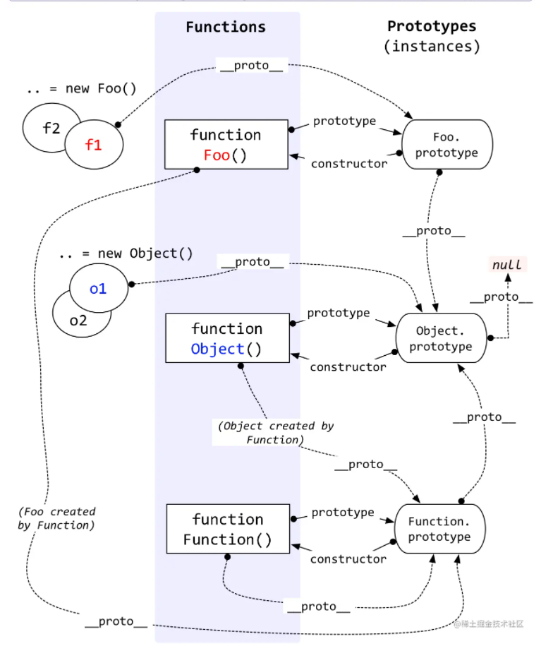


**总结：**

- 原型：每一个JavaScript对象（null除外）在创建的时候就会与之关联另一个对象，这个对象就是我们所说的原型，每一个对象都会从原型“继承”属性，其实就是`prototype`对象。
- 原型链：由相互关联的原型组成的**链状结构**就是原型链。


# 作用域和作用域链

- 作用域：规定了如何查找变量，也就是确定当前执行代码对变量的访问权限。作用域决定了代码区块中变量和其它资源的可见性。（全局作用域、函数作用域、块级作用域）
- 作用域链：从当前作用域开始一层一层往上找某个变量，如果找到全局作用域还没找到，就放弃寻找。这种层级关系就是作用域链。（由多个执行上下文的**变量对象**构成的链表就叫做作用域链。）


# 参考链接

[如何写出一个惊艳面试官的深拷贝?](https://juejin.cn/post/6844903929705136141)

[硬核基础二进制篇（一）0.1 + 0.2 != 0.3 和 IEEE-754 标准](https://juejin.cn/post/6940405970954616839)

[IEEE-754标准与JS中的Number类型](http://www.zzf9.com/Blog/IEEE-754%E6%A0%87%E5%87%86%E4%B8%8EJS%E4%B8%AD%E7%9A%84number%E7%B1%BB%E5%9E%8B/#0102)
