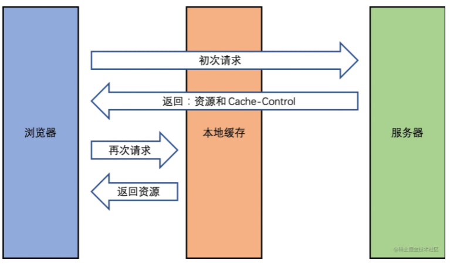
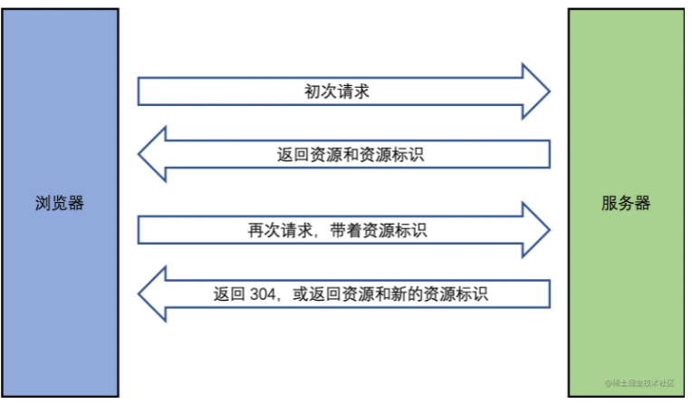
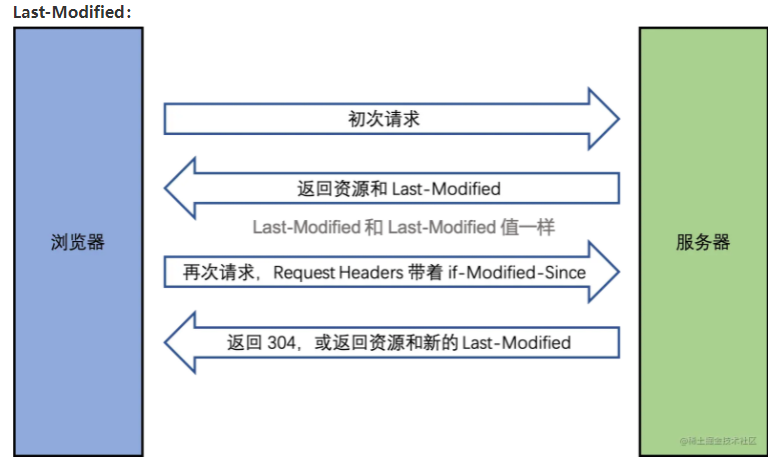
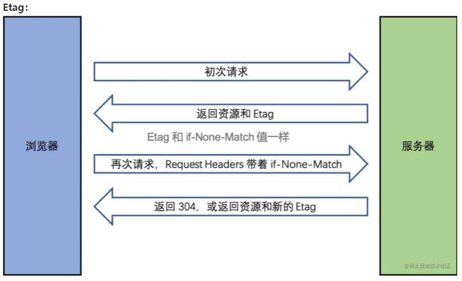
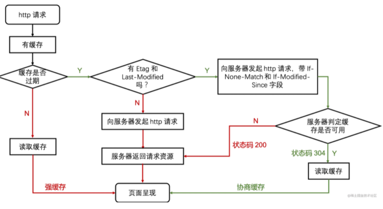

# HTTP状态码

## 状态码分类

- 1xx：服务器收到请求
- 2xx：请求成功，如200
- 3xx：重定向，如302
- 4xx：客户端错误，如404
- 5xx：服务端错误，如500

## 常见状态码

- 200：成功
- 301：永久重定向（配合location，浏览器自动处理）
- 302：临时重定向（配合location，浏览器自动处理）
- 304：资源未被修改
- 403：没权限
- 404：资源未找到
- 500：服务器错误
- 504：网关超时

# HTTP缓存

1. 关于缓存介绍
2. HTTP缓存策略（强制缓存+协商缓存）
3. 刷新操作方式，对缓存的影响

## 关于缓存

为什么需要缓存？ 网络请求相比于 CPU 的计算和页面渲染是非常非常慢的。

哪些资源可以被缓存？ 静态资源，比如 js css img。

## 强制缓存

**Cache-Control：**

- 在Response Headers中
- 控制强制缓存的逻辑
- 例如`Cache-Control: max-age=3000（单位是秒）`

**Cache-Control有哪些值：**

- `max-age`：缓存最大的过期时间
- `no-cache`：可以在客户端存储资源，每次都必须去服务端做新鲜度校验，来决定从服务端获取新的资源（200）还是使用客户端缓存（304）
- `no-store`：永远都不要在客户端存储资源，永远都去原始服务器去获取资源

## 协商缓存（对比缓存）

- 服务端缓存策略
- 服务端判断客户端资源，是否和服务端资源一样
- 一致则返回304，否则返回200和最新的资源

**资源标识：**

- 在Response Headers中，有两种
- `Last-Modified`：资源的最后修改时间
- `Etag`：资源的唯一标识（一个字符串，类似于人类的指纹）

**Last-Modified:**

服务端拿到 `if-Modified-Since` 之后拿这个时间去和服务端资源最后修改时间做比较，如果一致则返回 304 ，不一致（也就是资源已经更新了）就返回 200 和新的资源及新的 `Last-Modified`。

**Etag:**

其实 Etag 和 Last-Modified 一样的，只不过 Etag 是服务端对资源按照一定方式（比如 contenthash）计算出来的唯一标识，就像人类指纹一样，传给客户端之后，客户端再传过来时候，服务端会将其与现在的资源计算出来的唯一标识做比较，一致则返回 304，不一致就返回 200 和新的资源及新的 Etag。

**两者比较：**

- 优先使用 Etag。
- Last-Modified 只能精确到秒级。
- 如果资源被重复生成，而内容不变，则 Etag 更精确。

## 总结

## 三种刷新操作对HTTP缓存的影响

- 正常操作：地址栏输入url，跳转链接，前进后退等
- 手动刷新：f5，点击刷新按钮，右键菜单刷新
- 强制刷新：ctrl+F5， shift+command+r/ctrl+shift+r

正常操作：强制缓存有效，协商缓存有效

手动刷新：强制缓存失效，协商缓存有效

强制刷新：强制缓存失效，协商缓存失效

# 面试

文章推荐：

[（建议精读）HTTP灵魂之问，巩固你的 HTTP 知识体系](https://juejin.cn/post/6844904100035821575#heading-47)

[这一次，彻底理解 https 原理](https://juejin.cn/post/6844904038509576199)

[HTTPS底层原理，面试官直接下跪，唱征服！](https://www.bilibili.com/video/BV1XL411b7KZ?p=1)

[聊聊跨域的原理与解决方法](https://zhuanlan.zhihu.com/p/149734572?from_voters_page=true)