# 第一部分 输入网址并解析

## URL的组成

URL（Uniform Resource Locator），统一资源定位符，用于定位互联网上的资源，俗称网址。


```
scheme：协议，常见的有http、https、ftp、file
host：主机（域名），是资源所在的网站名或服务器的名字
port：端口，同一个域名下面可能同时包括多个网站，它们之间通过端口（port）区分，默认端口为80
path：定义服务器上的路径，如果省略，则访问网站的根目录（若后面未跟具体的文件名，通常返回该目录下的index.html）
filename：定义文档/资源的名称
query：查询参数（parameter）是提供给服务器的额外信息。参数跟在路径后面，用?分隔，以键值对（key=value）形式，参数可以有多组，用&连接
ancher：锚点（anchor）是网页内部的定位点，使用#加上锚点名称，放在网址的最后
```

## 解析URL

输入URL后，浏览器会解析出协议、主机、端口、路径等信息，并构造一个HTTP请求。

1. 浏览器发送请求前，根据请求头的`expires`和`cache-control`判断是否命中（包括是否过期）强缓存策略，如果命中，直接从缓存获取资源，并不会发送请求。如果没有命中，则进入下一步。
2. 没有命中强缓存规则，浏览器会发送请求，根据请求头的`If-Modified-Since`和`If-None-Match`判断是否命中协商缓存，如果命中，直接从缓存获取资源。如果没有命中，则进入下一步。
3. 如果前两步都没有命中，则直接从服务端获取资源。

## HSTS（HTTP Strict Transport Security）

由于安全隐患，会使用HSTS强制客户端使用HTTPS访问页面。

> 原理：
> - 在服务器响应头中添加`Strict-Transport-Security`，可以设置`max-age`
> - 用户访问时，服务器种下这个头
> - 下次如果使用http访问，只要max-age未过期，客户端会进行内部跳转，可以看到307 Redirect Internel的响应码
> 变成https访问源服务器
> 
> 详见：[你所不知道的HSTS](https://www.barretlee.com/blog/2015/10/22/hsts-intro/)

当你的网站均采用HTTPS，并符合它的安全规范，就可以申请加入HSTS列表，之后用户不加HTTPS协议再去访问你的网站时，浏览器都会定向到HTTPS。无论匹配到没有，都要开始DNS查询工作了。

## 浏览器缓存

### 强缓存

强制缓存就是向浏览器缓存查找该请求结果，并根据该结果的缓存规则来决定是否使用该缓存结果的过程。强缓存又分为两种`Expires`和`Cache-Control`

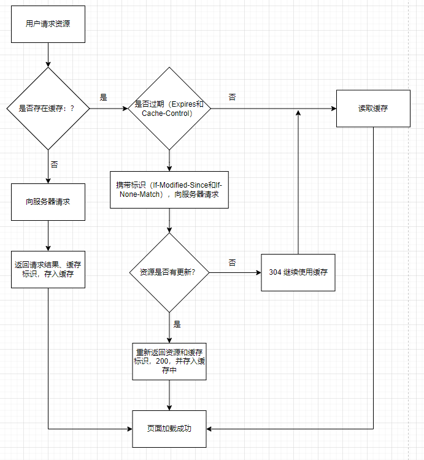

#### Expires

- 版本：HTTP/1.0
- 来源：存在于服务端返回的响应头中
- 语法：`Expires: Sun, 12 Jan 2022 21:42:00 GMT`
- 缺点：服务器的时间和浏览器的时间可能并不一致导致失效

#### Cache-Control

- 版本：HTTP/1.0
- 来源：响应头和请求头
- 语法：`Cache-Control: max-age=3600`
- 缺点：时间最终还是会失效

**请求头：**
|字段名称|说明|
|-|-|
|no-cache|告知（代理）服务器不直接使用缓存，要求向原服务器发起请求|
|no-store|所有内容都不会被保存到缓存或Internet临时文件中|
|max-age=delta-seconds|告知服务器，客户端希望接收一个存在时间不大于delta-seconds秒的资源|
|max-stale[=delta-seconds]|告知（代理）服务器，客户端愿意接收一个超过缓存时间的资源，若有定义delta-seconds则为delta-seconds秒，若没有则为任意超出时间|
|min-fresh=delta-seconds|告知（代理）服务器，客户端希望接收一个在小于delta-seconds秒内被更新过的资源|
|no-transform|告知（代理）服务器，客户端希望获取实体数据没有被转换（比如压缩）过的资源|
|only-if-cached|告知（代理）服务器，客户端希望获取缓存的内容（若有），而不用向原服务器发去请求|
|cache-extension|自定义扩展，若服务器不识别该值将被忽略掉|


**响应头：**
|字段名称|说明|
|-|-|
|public|表明任何情况下都得缓存该资源（即使是需要HTTP认证的资源）|
|Private=[field-name]|表明返回报文中全部或部分（若指定了field-name则为field-name的字段数据）仅开放给某些用户(服务器指定的share-user，如代理服务器）做缓存使用，其他用户则不能缓存这些数据|
|no-cache|不直接使用缓存，要求向服务器发起（新鲜度校验）请求|
|no-store|所有内容都不会被保存到缓存或Internet临时文件中|
|no-transform|告知客户端缓存文件时不得对实体数据做任何改变|
|only-if-cached|告知（代理）服务器，客户端希望获取缓存的内容（若有），而不用向源服务器发去请求|
|must-revalidate|当前资源一定是向源服务器发去验证请求的|
|proxy-revalidate|与must-revalidate类似，但仅能应用于共享缓存（如代理）|
|max-age=delta-seconds|告知客户端该资源在delta-seconds秒内是新鲜的，无需向服务器发请求|
|s-maxage=delta-seconds|同max-age，但仅能应用于共享缓存（如代理）|
|cache-extension|自定义扩展值，若服务器不识别该值将被忽略掉|

**示例**

```js
// server.js
const http = require('http');
const fs = require('fs');

http.createServer(function (request, response) {
  console.log("request: ", request.url);

  if (request.url === '/') {
    const html = fs.readFileSync('test.html', 'utf8');
    
    response.writeHead(200, {
      'Content-Type': 'text/html'
    })

    response.end(html);
  }

  if (request.url === '/script.js') {
    console.log("script被请求了")
    response.writeHead(200, {
      'Content-Type': 'text/javascript',
      'Cache-Control': 'max-age=20, public' // 缓存20s，多个值用逗号分开
    })

    response.end("console.log('script loaded')");
  }
}).listen(8888)

console.log("server listening on 8888");
```

```html
<!-- test.html -->
<!DOCTYPE html>
<html lang="en">
<head>
  <meta charset="utf-8">
  <meta name="viewport" content="width=device-width, initial-scale=1.0">
  <title>Document</title>
</head>

<body>
  
  <script src="/script.js"></script>

<script>
    setTimeout(function() {
	  console.log("one")
      fetch("http://127.0.0.1:8888/script.js")
    }, 3e3)
	
	setTimeout(function() {
	  console.log("two")
      fetch("http://127.0.0.1:8888/script.js")
    }, 20e3)
  </script>
</body>
</html>
```


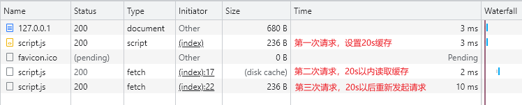

### 协商缓存

协商缓存就是强制缓存失效后，浏览器携带缓存标识向服务器发起请求，由服务器根据缓存标识决定是否使用缓存的过程。

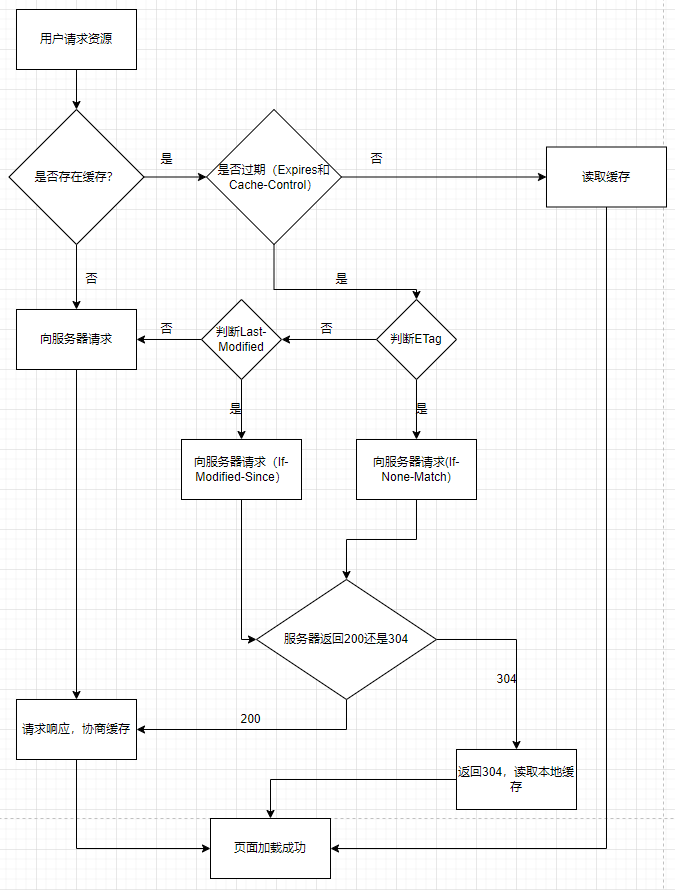

#### 模拟Last-Modified

```js
// server.js
const http = require('http');
const fs = require('fs');
const path = require('path');

http.createServer(function (request, response) {
	
  console.log("request: ", request.url);

  if (request.url === '/') {
    const html = fs.readFileSync('test.html', 'utf8');
    
    response.writeHead(200, {
      'Content-Type': 'text/html'
    })

    response.end(html);
  }
  
  if (request.url === '/script.js') {
		console.log("script.js被请求了")
    const filePath = path.join(__dirname, request.url); // 拼接当前脚本的文件地址
    const stat = fs.statSync(filePath); // 获取当前脚本文件的状态
    const mtime = stat.mtime.toGMTString(); // 文件的最后修改时间
    const requestMtime = request.headers['if-modified-since']; // 来自浏览器传递的值

    console.log(stat);
    console.log(mtime, requestMtime);

    // 走协商缓存
    if (mtime === requestMtime) {
      response.statusCode = 304;
      response.end();
      return;
    }

    // 协商缓存失效，重新读取数据设置Last-Modified响应头
    console.log("协商缓存Last-Modified失效");
    response.writeHead(200, {
      "Content-Type": "text/javascript",
      "Last-Modified": mtime
    })

    const readStream = fs.createReadStream(filePath);
    readStream.pipe(response);
    
  }
}).listen(8888)

console.log("server listening on 8888")
```

```html
<!-- test.html -->
<!DOCTYPE html>
<html lang="en">
<head>
  <meta charset="utf-8">
  <meta name="viewport" content="width=device-width, initial-scale=1.0">
  <title>Document</title>
</head>

<body>
  
  <button onclick="reqOne()">请求一</button>
  <br>
  <br>
  <hr>
  <br>
  <button onclick="reqTwo()">请求二</button>

  <script>
		function reqOne() {
			console.log("one")
			fetch("http://127.0.0.1:8888/script.js")
		}
		
		function reqTwo() {
			console.log("two")
			fetch("http://127.0.0.1:8888/script.js")
		}
  </script>
</body>
</html>
```

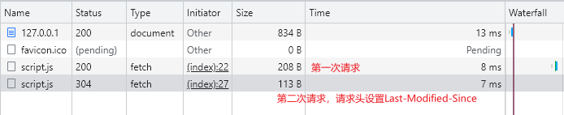

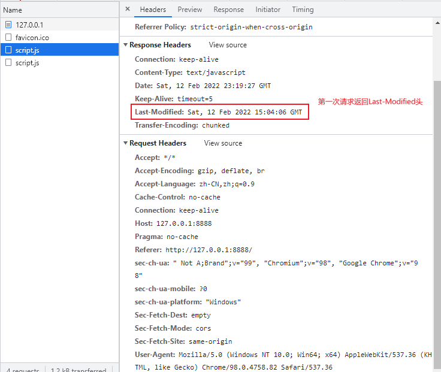

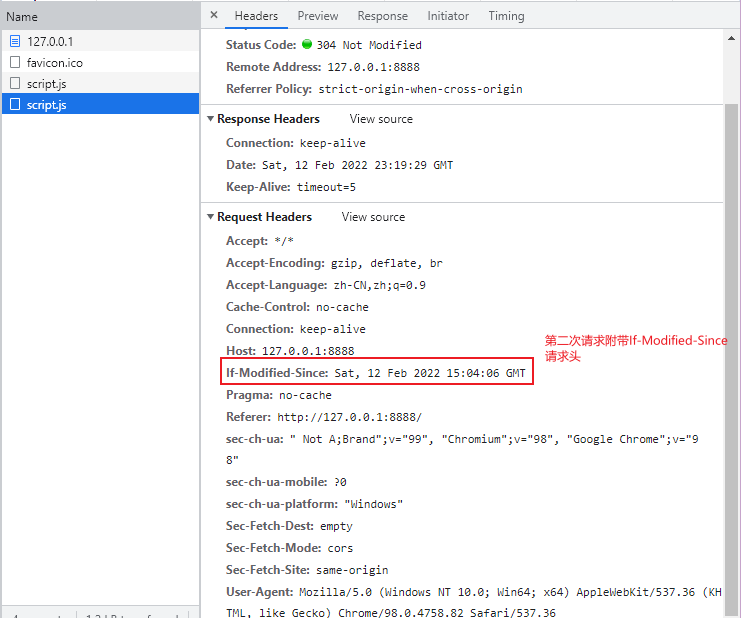

#### 模拟ETag

```js
// server.js
const http = require('http');
const fs = require('fs');
const path = require('path');
const md5 = require('md5');
http.createServer(function (request, response) {
	
  console.log("request: ", request.url);
  if (request.url === '/') {
    const html = fs.readFileSync('test.html', 'utf8');
    
    response.writeHead(200, {
      'Content-Type': 'text/html'
    })
    response.end(html);
  }
  
  if (request.url === '/script.js') {
		console.log("script.js被请求了")
    const filePath = path.join(__dirname, request.url); // 拼接当前脚本的文件地址
    const buffer = fs.readFileSync(filePath); // 获取当前脚本文件
		const fileMd5 = md5(buffer); // 文件的Md5值
		const noneMatch = request.headers["if-none-match"]; // 来自浏览器端传递的值
		
		if (noneMatch === fileMd5) {
			response.statusCode = 304;
			response.end();
			return;
		}
		
		console.log("ETag缓存失效")
		
		response.writeHead(200, {
			"Content-Type": "text/javascript",
			"Cache-Control": "max-age=0",
			"ETag": fileMd5
		})
		
    const readStream = fs.createReadStream(filePath);
    readStream.pipe(response);
  }
}).listen(8888)
console.log("server listening on 8888")
```

```html
<!-- test.html -->
<!DOCTYPE html>
<html lang="en">
<head>
  <meta charset="utf-8">
  <meta name="viewport" content="width=device-width, initial-scale=1.0">
  <title>Document</title>
</head>

<body>
  
  <button onclick="reqOne()">请求一</button>
  <br>
  <br>
  <hr>
  <br>
  <button onclick="reqTwo()">请求二</button>

  <script>
		let ETag;
		function reqOne() {
			console.log("one")
			fetch("http://127.0.0.1:8888/script.js")
		}
		
		function reqTwo() {
			console.log("two")
			fetch("http://127.0.0.1:8888/script.js")
		}
  </script>
</body>
</html>

```

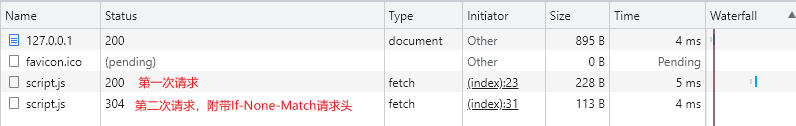

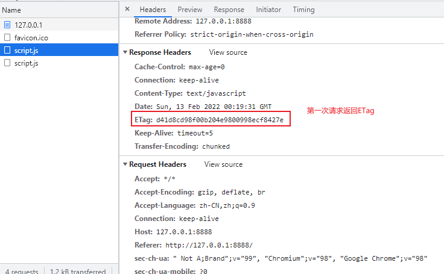

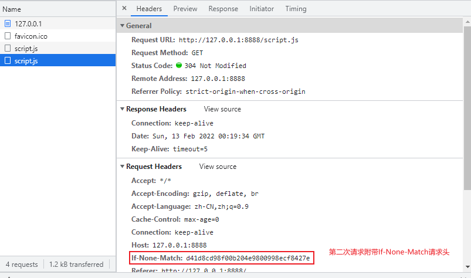

**Last-Modified（响应头），If-Modified-Since（请求头）**

在浏览器第一次给服务器发送请求后，服务器会在响应头中加上`Last-Modified`这个字段。浏览器接收到后，如果再次请求，会自动在请求头中携带`If-Modified-Since`字段，这个字段的值也就是服务器传来的最后修改时间。服务器拿到请求头中的`If-Modified-Since`字段后，会和服务器中该资源的最后修改时间`Last-Modified`对比，询问服务器在该日期后该资源是否有更新，有更新的话就会将新的资源发送回来。

但是如果在本地打开缓存文件，就会造成`Last-Modified`被修改，所以在`HTTP/1.1`中出现了`ETag`。

**Etag（响应头），If-None-Match（请求头）**

`ETag`是服务器根据当前文件的内容，给文件生成的唯一标识，只要里边的内容有改动，这个值就会变。服务器通过响应头把这个值给浏览器。浏览器接收到ETag的值，会在下次请求时将这个值作为`If-None-Match`这个字段的内容，并放到请求头中发给服务器。

> 如果两种方式都支持的话，服务器会优先考虑ETag

## 存储位置

### Service Worker

`Service Worker`是运行在浏览器背后的独立线程，一般可用来实现缓存功能。使用`Service Worker`的话，传输协议必须为`HTTPS`。因为`Service Worker`中涉及到请求拦截，所以必须使用`HTTPS`协议来保障安全。`Service Worker`的缓存与浏览器其它内建缓存机制不同，它可以让我们自由控制缓存哪些文件、如何匹配缓存、如何读取缓存，并且缓存是持续性的。

`Service Worker`实现缓存功能一般分为三个步骤：

1. 首先需要注册`Service Worker`
2. 然后监听到`install`事件以后就可以缓存需要的文件
3. 那么在下次用户访问的时候就可以通过拦截请求的方式查询是否存在缓存，存在缓存的话就可以直接读取缓存文件，否则就去请求数据

当`Service Worker`没有命中缓存的时候，我们需要去调用`fetch`函数获取数据。也就是说，如果我们没有在`Service Worker`命中缓存的话，会根据缓存查找优先级去查找数据。但是不管我们是从`Memory Cache`中还是网络请求中获取的数据，浏览器都会显示我们从`Service Worker`中获取的内容。

### Memory Cache

`Memory Cache`也就是内存中的缓存，主要包含的是当前页面中已经抓取到的资源，例如页面上已经下载的样式、脚本、图片等。读取内存中的数据肯定比磁盘快，内存缓存虽然读取搞笑，可是缓存持续性很短，会随着进程释放而释放。一旦我们关闭Tab页面，内存中的缓存也就被释放了。

> 需要注意的是，内存缓存在缓存资源时并不关心返回资源的HTTP缓存头`Cache-Control`是什么值，同时资源的匹配也并非仅仅是对URL做匹配，还可能对`Content-Type`， CORS等其它特征做校验。

### Disk Cache

`Disk Cache`也就是存储在硬盘中的缓存，读取速度慢点，但是什么都能存储到磁盘中，比之`Memory Cache`胜在容量和存储时效性上。

### Push Cache

`Push Cache`（推送缓存）是`HTTP/2`中的内容，当以上三种缓存都没有命中时，它才会被使用。它只在回话（Session）中存在，一旦会话结束就被释放，并且缓存时间也很短暂，在Chrome浏览器中只有5分钟左右，同时它也并非严格执行HTTP头中的缓存指令。

1. 所有的资源都能被推送，并且能够被缓存
2. 可以推送`no-cache`和`no-store`的资源
3. 一旦连接被关闭，`Push Cache`就被释放
4. 多个页面可以使用同一个`HTTP/2`的连接，也就可以使用同一个`Push Cache`。这主要还是依赖浏览器的实现而定，处于对性能的考虑，有的浏览器会对相同的域名但不同的tab标签使用同一个HTTP连接。
5. `Push Cache`中的缓存只能被使用一次
6. 浏览器可以拒绝接受已经存在的资源推送
7. 你可以给其它域名推送资源

## DNS域名解析

在发起http请求之前，浏览器会发送一个UDP的包给DNS域名解析服务器来获取我们要访问网页的IP地址。

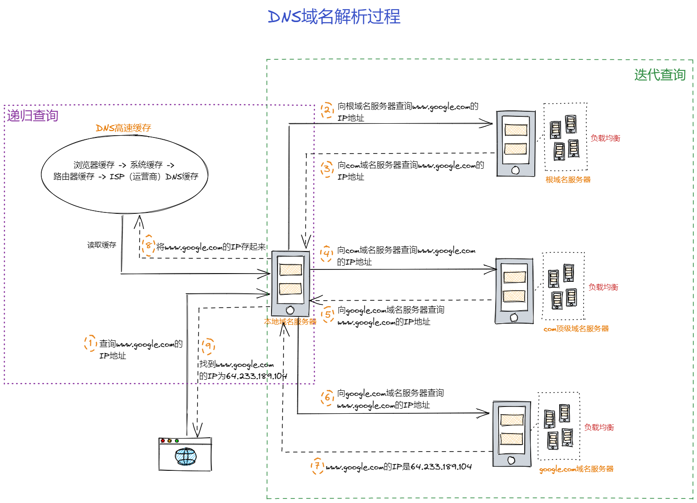

### 递归查询

我们的浏览器、操作系统、路由器都会缓存一些URL对应的IP地址，统称为DNS高速缓存。这是为了加快DNS解析速度，使得不必每次都到根域名服务器中去查询。


### 迭代查询

迭代查询的方式就是，局部的DNS服务器并不会自己向其它服务器进行查询，而是把能够解析该域名的服务器IP地址返回给客户端，客户端会不断向这些服务器进行查询，直到查询到了位置。

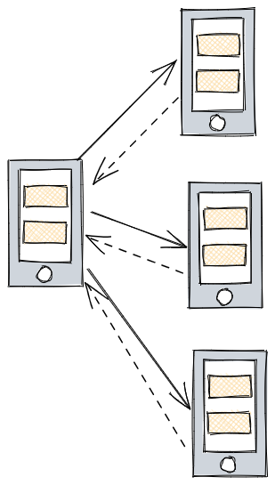

### DNS负载均衡

DNS还有负载均衡的作用，现在很多网站都有多个服务器，当一个网站访问量过大的时候，如果所有的请求都在同一个服务器上，可能服务器就会崩溃，这个时候就用到了DNS负载均衡技术，当一个网站有多个服务器地址时，在应答DNS查询的时候，DNS服务器会对每个查询返回不同的解析结果，也就是返回不同的IP地址，从而把访问引导到不同的服务器上去，来达到负载均衡的目的。例如可以根据每台机器的负载量，或者该机器距离用户的地理位置距离等等条件。（例如CDN（Content Delivery Network））

### DNS预解析

大型网站，有多个不同服务器资源的情况下，都可采取DNS预解析，提前解析，减少页面卡顿。

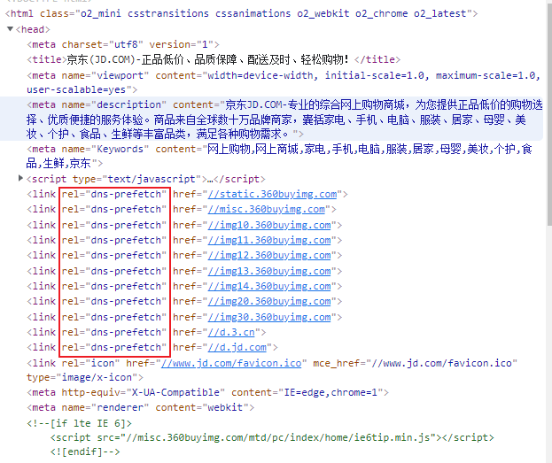

# 第二部分TCP/IP连接：三次握手

## 网络协议分层

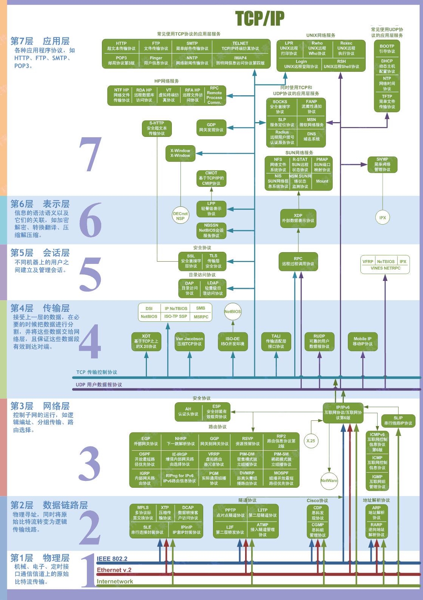

## TCP/IP协议

TCP（Transmission Control Protocol）传输控制协议。TCP/IP协议将应用层、表示层合并为应用层；物理层和数据链路层合并为网络接口层。

> TCP/IP协议不仅仅指的是TCP和IP两个协议，而是指的一个由FTP、SMTP、TCP、UDP、IP、ARP等等协议构成的协议集合

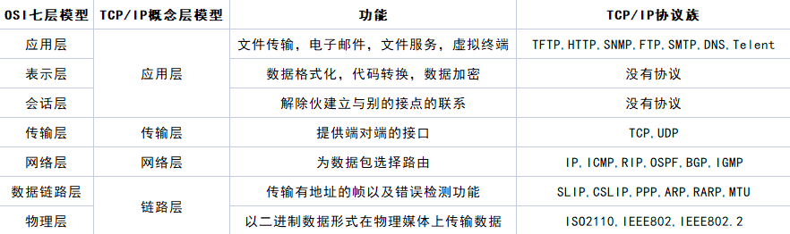

## 三次握手

客户端和服务端在进行HTTP请求和返回的过程中，需要创建一个`TCP Connection`（由客户端发起），`http`不存在连接这个概念，它只有请求和响应。请求和响应都是数据包，它们之间的传输通道就是`TCP Connection`。 

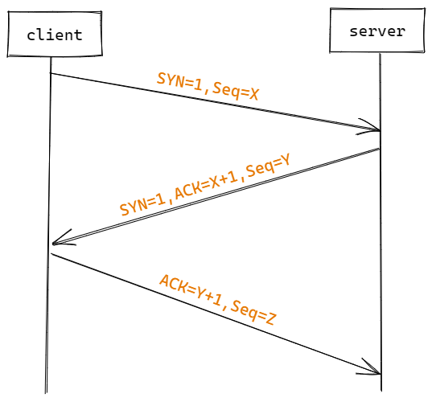

位码即TCP标志位，有6种标示：
- SYN（synchronous建立联机）
- ACK（acknowledgement确认）
- PSH（push传送）
- FIN（finish结束）
- RST（reset重置）
- URG（urgent紧急）

第一次握手：主机A发送位码为`SYN=1`，随机产生`Seq number=1234567`的数据包到服务器，主机B由`SYN=1`知道，A要求建立联机；（第一次握手，由浏览器发起，告诉服务器我要发送请求了）

第二次握手：主机B收到请求后要确认联机信息，向A发送`ACK number=（主机A的Seq+1）`, `SYN=1, ACK=1234567 + 1`，随机产生`Seq=7654321`的包；（第二次握手，由服务器发起，告诉浏览器我准备接受了，你赶紧发送吧）

第三次握手：主机A收到后检查`ACK number`是否正确，即第一次发送的`Seq number + 1`，以及位码`SYN`是否为1，若正确，主机A会再发送`ACK number=（主机B的Seq + 1）`，`ACK=7654321 + 1`，主机B收到后确认`Seq`值与`ACK=7654321 + 1`，连接建立成功。（第三次握手，由浏览器发送，告诉服务器，我马上就发了，准备接受吧）

> 为什么需要三次握手？两次不行吗？
> 其实这是由TCP的自身特点 **可靠传输** 决定的。客户端和服务端要进行可靠传输，那么就需要**确认双方的接收和发送能力**。第一次握手可以去人客户端的**发送能力**，第二次握手，服务端`SYN=1, Seq=Y`就确认了**发送能力**， `ACK=X+1`就确认了**接收能力**，所以第三次握手才可以确认客户端的**接收能力**。不然容易出现丢包的现象。

**第三次握手的必要性**

试想如果是用两次握手，则会出现下面这种情况：如客户端发出连接请求，但因连接请求报文丢失而未收到确认，于是客户端再重传一次连接请求。后来收到了确认，建立了连接。数据传输完成后就释放了连接，客户端共发出了两个连接请求报文段，其中一个丢失，第二个到达了服务端，但第一个丢失的报文段只是在某些网络结点长时间滞留了，延误到连接释放后的某个时间才到达服务端，此时服务端误以为客户端又发出一次新的连接请求，于是就像客户端发出确认报文段，同意建立连接，不采用三次握手，只要服务端发出确认，就建立新的连接了，此时客户端忽略服务端发来的确认，也不发送数据，则服务端一直等待客户端发送数据，浪费资源。

**什么是半连接队列？**

服务器第一次收到客户端的SYN之后，就会处于SYN_RCVD状态，此时双方还没有完全建立起连接，服务器会把此种状态下请求连接放在一个队列里，我们把这种队列称之为半连接队列。

当然还有一个全连接队列，就是已经完成三次握手，建立起连接的就会放在全连接队列中。如果队列满了就有可能出现丢包的现象。

这里补充一点关于SYN-ACK重传次数的问题：服务器发送完SYN-ACK包，如果未收到客户端确认包，服务器进行首次重传，等待一段时间仍未收到客户确认包，进行第二次重传。如果重传次数超过系统规定的最大重传次数，系统将该连接信息从半队列中删除。

注意，每次重传等待的时间不一定相同，一般会是指数增长，例如时间间隔：1s, 2s, 4s, 8s...

**ISN（Initial Sequence Number）是固定的吗？**

当一端为建立连接而发送它的SYN时，它为连接选择一个初始序号。ISN随时间而变化，因此每个连接都将具有不同的ISN。ISN可以看作是一个32比特的计数器，每4ms加1.这样选择序号的目的在于防止网络中被延迟的分组在以后又被传送，而导致某个连接的一方对它做错误的解释。

三次握手的其中一个重要功能是客户端和服务端交换ISN（Initial Sequence Number），以便让对方知道接下来接收数据的时候如何按序列号组装数据。如果ISN是固定的，攻击者很容易猜出后续的确认号，因此ISN是动态生成的。

**三次握手过程中可以携带数据吗？**

其实第三次握手的时候，是可以携带数据的。但是，第一次、第二次握手不可以携带数据。

为什么这样呢？假如第一次握手可以携带数据的话，如果有人要恶意攻击服务器，那他每次都在第一次握手中的SYN报文中放入大量的数据。因为攻击者根本就不理服务器的接收、发送能力是否正常，然后疯狂重复发SYN报文，这会让服务器花费更多时间、内存空间来接收这些报文。

也就是说，第一次握手不可以放数据，其中一个简单的原因就是会让服务器更加容易受到攻击。而对于第三次的话，此时客户端已经处于ESTABLISHED状态。对于客户端来说，它已经建立起了连接，并且也已经知道服务器的接收、发送能力是正常的了，所以能携带数据。

**SYN攻击？**


# 参考链接：

1. [从URL输入到页面展现到底发生什么？](https://juejin.cn/post/6844903784229896199)
2. [从输入URL开始建立前端知识体系](https://juejin.cn/post/6935232082482298911)
3. [阮一峰HTML语言教程](https://www.bookstack.cn/read/html-tutorial/spilt.2.docs-url.md#bqbmhb)